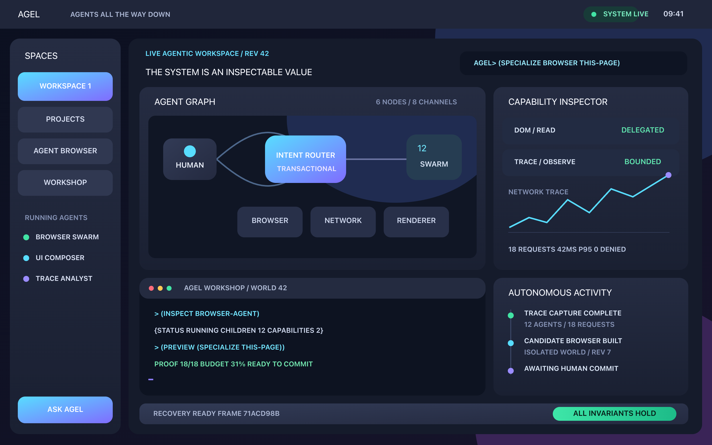

# Agel

Agel is an experimental agentic Lisp and, eventually, an operating system in
which agents are first-class values. The project starts as a safe host runtime
and will progressively replace its host components with code written in Agel.

The current repository is **v0.2.62: the desktop runs on QEMU's Raspberry Pi 4, its framebuffer from the firmware's mailbox and its compositor an AArch64 domain, driven from the serial console; files grow to 64 KiB over a pool of blocks the filesystem service zeroes as it hands them out; a C program's heap grows through pages the supervisor maps at its break, it changes directory and truncates files; programs read a monotonic clock, sleep, kill their own children, escape with `longjmp` and keep an environment; they remove, rename, stat and list files through the namespace, scan input and parse options; a Raspberry Pi 5 image is built from the board's documented addresses, unrun until the board arrives; the AArch64 kernel boots on QEMU's Raspberry Pi 4 as a flat image entered at EL2 and drives its SD card through an unprivileged SD host controller driver, so programs load and the workspace persists on the card; soft shadows, one-pixel edges and press states give the desktop depth; windows move by their header, come to the front when clicked, and hand a process
the pointer's motion and release after a press; a window listens, so a process waits for presses and keys in it while the desktop
keeps running, through a process table that runs in passes; a process owns a window on the desktop, drawing records the supervisor checks
against the window's content and keeps, so the window outlives its process, with a close control and a C header for it; the desktop responds to the pointer, with a launcher over the program
region, dock tiles that act, hover states and a clock from a driver domain; programs run on the desktop, with `:exec` in the graphical workshop
and a terminal panel in its window showing what they write; the native desktop runs at 1920×1080 with an arrow cursor, dock
icons and window controls from a sprite sheet, and never loses a keystroke to painting; it draws anti-aliased Fira Sans and Fira Mono from
font atlases in a new asset region of the disk, blends rounded surfaces with soft shadows, and is
styled with COSMIC's dark palette, radii and spacing, a first step toward a desktop of that quality; C programs take arguments, allocate from a heap that gives memory
back, read and write files through streams with seek and append, and an unmodified public-domain
SHA-256 source builds and runs with the digest the host computes; a process starts another by name with exactly the descriptors
and the namespace it chooses to give, never by `fork`, pipes are supervisor queues and `wait` blocks,
so a C pipeline of a parent and a child runs on all three research machines; C programs build from source against `agel-libc`, a Rust static
archive with a C ABI, and run as processes on all three research machines, with `printf`, a heap, the
string routines and files through their namespace; a process reaches files only through the namespace it was given,
served by an unprivileged filesystem service that reaches the disk only through the supervisor, with
descriptors that fail closed when the service restarts, on all three research machines; the disk layout has grown so the kernel can, with 508-sector kernel
slots loaded by four BIOS transfers and every region after them moved to make room; the POSIX personality has its first stratum, a program loaded from
the disk into a fresh protection domain on any of the three research machines, writing to the console and
exiting through a request protocol on its shared page, with a hostile program contained and its frames
reclaimed; the kernel contract's memory group is real on all three research
kernels, where a world's frame mappings are page-table entries the supervisor reconciles with the
object table after every operation, so a read-only mapping refuses a write and an unmapped page
faults; contract v1.1 specifies that group, both hosted implementations answer it identically across
118 corpus steps, and every native backend publishes the profile it can make real; the native evaluator runs inside the seL4 world protection
domain too, so the language has evaluated the same forms unprivileged on all four backends; stored native functions carry their captured scalars, so a closure
made inside a lexical call can be defined and a lambda escaping a stored function is kept rather than
refused; native actor slots can be given back, with generation-checked
handles so a reaped agent's handle is refused rather than reaching its successor; a driver domain that dies and is replaced costs nothing lasting,
because the frame pool takes a dead domain's frames back and builds its replacement from them, proved
on all three research machines; a power cut at every one of the eighteen sector writes of a
workspace save, on every machine, leaves a whole generation, proved by a fault-injection command
that tears the write and halts; the durable workspace and the recovery plane exist on all three
research machines, with a virtio block device driven from an unprivileged domain on AArch64 and
RISC-V, so the same edit, save, reboot, verify, promote and watchdog-rollback cycle is proved on
each; a staged candidate kernel is loaded only after the running
kernel has hashed the slot and verified an Ed25519 signature against the key it was built with, using
the project's own verifier compiled into the freestanding kernel; every native backend answers the kernel contract with the
independently written second implementation, and the three research kernels check all 81 of an
unprivileged world's answers against the reference model live, so the frozen transcript is two
implementations agreeing behind a hardware boundary on four backends; the x86-64 kernel image itself is A/B selected by the
512-byte BIOS stage, which charges every boot of a candidate kernel before it runs and loads the
trusted slot after three boots that never reach a healthy state, with promotion an explicit
decision and staging a host tool; the recovery plane is on disk, binding trusted and
candidate workspace generations, charging every boot of an unverified candidate before it runs,
rolling a candidate that fails three boots back automatically, and taking a `health` cell evaluated
in an isolated world as explicit evidence; the interactive workshop runs on all three research
machines, with the AArch64 and RISC-V sessions driven over their UARTs by the same
prompt-synchronized test as x86-64; input leaves the supervisor too, with serial bytes read
through the console driver domain and keyboard/pointer bytes through an 8042 driver domain
granted only two ports; the disk leaves the supervisor into an unprivileged,
restartable ATA driver domain granted exactly nine I/O ports, with generation-checked handles
and a stale-handle refusal proved in CI; a second, independently written implementation of the
kernel contract that reproduces the frozen transcript and runs inside the seL4 broker, so the
seL4 backend's byte-identical transcript is now two implementations agreeing; Ed25519-signed
portable images and promotion evidence
from a dependency-free, RFC-vector-tested implementation, with verified loads that never
downgrade to an unsigned generation; strings, symbols, lists and maps as first-class values
inside the freestanding evaluator, in a bounded heap with a copying collector at every commit,
so quoted data persists in native globals and travels in native agent messages; plus
a live upgrade pipeline in the CLI (proposal files
verified in a zero-authority canary, then promoted atomically or recorded into a portable
image), conservative effect inference over first-class builtins, a typed default-deny
effect policy consulted by every model process launch, a policy-mediated copy-on-write
workspace broker, a three-evaluator conformance corpus that now covers maps and text, and a
freestanding evaluator with `let`, variadic arithmetic and multi-form functions; on top of
native Agel module linking and expression-template
macro expansion with a preview/persistence bridge into the real OS, a native Agel reader that reads and rebuilds
the reader and compiler from source text, agent-proposed native behavior upgrades with
revision-bound preview and code-only rollback, a self-compiling Agel frontend with validated
tail calls and safe-boundary heap reclamation, an Agel-written compiled mailbox scheduler, native lexical closures,
immutable collections and metered calls, plus the compact
integer machine-code JIT, alongside reusable execution plans analyzed in Agel,
shared immutable closure storage in the Rust bootstrap, and
source-backed agents, alongside a native agent workbench with failure-safe source saves,
bounded process execution, pointer events,
keyboard focus, source inspection, candidate preview/promotion and recoverable
behavior replacement. See [the workbench guide](docs/native-workbench.md).
Agel-authored live native scenes and agents run inside the persistent
graphical Agel workshop. Fixed-memory actors now spawn, exchange bounded FIFO
messages, run deterministic transactional turns, compose, expose live state,
and contain a failed behavior inside the unprivileged evaluator domain. The
hosted runtime retains richer typed protocols, supervision, model calls, and
agentic fixed points while their primitives are bootstrapped downward. The
desktop evaluates real Agel forms in an independent ring-3 domain and saves
bounded named source cells to alternating checked disk slots, reconstructing
the language world by replay after reboot. The QEMU-window keyboard and serial
console also drive transactional live scene changes while a dedicated ring-3
compositor remains the only component holding the framebuffer grant**. The hosted scene, layout,
paths, paints, transforms, clipping, and
transactional desktop/layout/vector agents remain written in Agel. It retains the frozen kernel contract,
portable isolation backend, unmodified seL4 backend, and
restartable privileged console service from the v0.1 line.

Agel is still pre-production. Project releases follow the policy in
[`docs/versioning.md`](docs/versioning.md); `v1.0.0` is reserved for the first
production-ready system. The separately versioned kernel contract remains v1.0.

Try the live upgrade pipeline and a portable world:

```sh
cargo run -q -p agel-cli -- --image target/agel-world.image
```

Add `--keygen keys/agel.hex` once, then `--signing-key keys/agel.hex` to sign
every image root and verify every load against that key.
Inside the REPL, `:propose examples/upgrade-proposal.agel` reads a proposal
file, infers its effects, runs its `;test` lines in a zero-authority canary and
prints evidence; `:promote` commits it atomically or `:discard` drops it. Every
committed input, grant and model completion is appended to the tamper-evident
image and replayed on the next start. See [evidence-carrying upgrades](docs/evidence-upgrades.md)
and [portable images](docs/portable-images.md).

Try modular compilation and the live OS bridge:

```sh
cargo run --release -q -p agel-jit --example module_workshop
./scripts/run-graphics.sh --workbench --web
```

In a fresh OS world enter `:workbench`, open **Compile a modular dock behavior**,
then **Compile and preview**. Use `:promote` or `:discard`; stage the expanded
source and `:save` to keep it after reboot. The optional web panel compiles on
the host; the actual candidate, agent turn, scene and save run in the QEMU guest.
See [modules, macros and the OS bridge](docs/native-modules.md).

Try the compiler bootstrap and native closure workshop (Rust 1.86+):

```sh
cargo run --release -q -p agel-jit --example self_host
cargo run --release -q -p agel-jit --example text_workshop
```

It checks identical IR across the seed and two native compiler stages, then
runs captured, replaceable behaviors over immutable state. See
[the managed JIT contract](docs/managed-jit.md). The frontend self-compiles;
the whole language runtime and OS are **not** yet self-hosted.
The [text workshop](docs/native-reader.md) drops the Rust evaluator after bootstrap,
then reads, compiles and executes source text through native Agel. Pass a file
containing one closed `(fn (n) ...)` to `text_workshop` to run it with `n = 10`.

Try the isolated, compiled Agel scheduler and paired compiler benchmark:

```sh
cargo run --release -q -p agel-jit --example agent_swarm
cargo run --release -q -p agel-jit --example compiler_bench
cargo run --release -q -p agel-jit --example agent_swarm -- --ping
cargo run --release -q -p agel-jit --example memory_bench
```

[Tail calls and compiled actors](docs/native-tail-agents.md) describes the
transaction, peer-permission and resource boundaries. This scheduler is not
yet integrated into hosted `World` actors or the freestanding OS.
See [tail-boundary collection](docs/tail-collection.md) for reclamation guarantees,
remaining limitations, and paired retained-memory measurements.

Try a compiled designer agent that proposes new code, previews it, and changes
another actor's behavior without losing queued messages:

```sh
cargo run --release -q -p agel-jit --example live_upgrade
```

The counter switches from `+1` to `+10`, then back to `+1` without rewinding its
state. Source composition and compiler lowering run in native Agel after
bootstrap. Promotion remains an explicit host decision; a passing preview is
not a proof. See [native code upgrades](docs/native-code-upgrades.md).

It provides:

- a small, homoiconic Lisp reader and evaluator;
- atomic evaluation: a submitted batch either commits completely or changes
  nothing;
- versioned world state with explicit rollback;
- lexical closures and definition-site hygienic template macros;
- explicit modules, persistent maps, structured conditions and named restarts;
- host-issued, scope-checked capabilities and deterministic resource budgets;
- executable agents with isolated heaps and typed message protocols;
- deterministic cooperative scheduling and supervision trees;
- transactional agent turns, structured event history, snapshots, and replay;
- transactional model-request outboxes with exact-response replay;
- capability-scoped, explicit adapters for real Claude Code and Codex CLIs;
- SHA-256-bound proposals, zero-authority canaries, executable evidence, and
  atomic promotion;
- a non-rollback effect journal and epoch-bound capability revocation; and
- typed, default-deny effect intents with inspectable audit records;
- one constrained process boundary used by both real model adapters; and
- an in-memory copy-on-write workspace for disposable agent changes;
- canonical event-sourced images with a tamper-evident SHA-256 chain;
- Ed25519-signed image roots and promotion evidence, verified against a
  trusted key on load, from an RFC-vector-tested implementation with no
  third-party code;
- exact offline reconstruction with fresh capability authority; and
- atomic image replacement, stale-writer detection, and previous-image recovery;
- an atomic standard library written in Agel, not privileged Rust;
- persistent sequence and tagged-result libraries; and
- typed round-robin worker pools with bounded transactional scheduling;
- eager-safe lexical fixed points, explicitly metered anonymous recursion, and
  bounded convergence over immutable application descriptions;
- an Agel-written agent fixed-point driver with explicit transitions,
  decreasing step and model budgets, bounded redacted trace, and
  message-ordered live code evolution;
- `type-of` and `apply`, the two small reflective primitives needed by libraries;
- checked integer ordering through the ordinary `<` builtin used by geometry;
- an `agel/meta` evaluator written in Agel for a lexical functional subset,
  with shared three-evaluator conformance tests and inspectable source-backed
  hosted agents in `agel/meta-agent` (see [Agel in Agel](docs/agel-in-agel.md));
- an `agel/ui` retained scene and semantic action model written in Agel;
- inspectable UI patches and a typed desktop agent with validated preview,
  atomic commit, discard, and live rollback;
- deterministic fixed/flexible row and column layout written in Agel;
- a COSMIC-inspired default panel, workspace, applets, launcher, and dock;
- renderer-neutral fill/stroke/text display lists with strict validation;
- resolution-independent paths, cubic curves, ellipses, rounded rectangles,
  gradients, fixed-point transforms, clipping, strokes, and vector text written
  in `agel/vector`;
- an Agel-authored UI-to-vector compiler and typed vector agent that preserves
  its last good frame after a rejected render;
- deterministic 1×–8× SVG output through a bounded, dependency-free Rust
  renderer that independently validates untrusted vector frames;
- a native VBE linear-framebuffer handoff established before long mode;
- a bounded native vector stream authored as Agel data and compiled into the
  reproducible boot image;
- an unprivileged software compositor with the framebuffer as its only device
  mapping, procedural resolution-independent cell-vector text, and no UI policy;
- deterministic native framebuffer hashing, malformed-command rejection,
  compositor fault containment, replacement, and retained last-good pixels;
- nonblocking serial and PS/2 keyboard input normalized into the same bounded
  live-desktop stream, with mouse bytes explicitly separated;
- a native graphical Agel command surface supporting transactional accent,
  workspace, and title mutation plus inspect, help, and live rollback;
- real native Agel evaluation from that graphical surface in a second isolated
  domain, with errors rolling back the evaluator transaction;
- graphical named source-cell staging, replay-validated dual-slot save, reload,
  and automatic reconstruction after reboot;
- fixed-memory native agents with data-carrying state and messages, bounded FIFO
  mailboxes, deterministic round-robin turns, transactional sends/state, live
  inspection, and contained fault/drop/restart recovery;
- semantic hit-testing that returns inspectable intents without executing them;
- an isolated layout agent that preserves its last good frame when compilation
  fails;
- an independent Common Lisp reference checked against the Rust seed; and
- external A/B image canary, evidence-bound promotion, and rollback;
- a modality-neutral text/voice interaction handoff with a 200 ms foreground
  acknowledgement contract, bounded background work, and verified human authority;
- a reproducible 128 KiB BIOS boot seed in a persistent 1 MiB raw disk that
  enters x86-64 long mode in QEMU;
- a freestanding Rust serial HAL and interactive recovery monitor; and
- boot-time A/B denial, verification, promotion, and watchdog rollback checks;
- a fixed-memory Agel reader and evaluator running inside the VM;
- native transactional definitions, functions, recursion, quote/eval, monotonic
  revisions, and one-step world rollback;
- a versioned, backend-neutral kernel contract with an executable reference
  model and a 118-step conformance corpus frozen as one canonical transcript per published profile;
- kernel-built page tables, per-domain address spaces, write-xor-execute, trap
  entry, and a 100 Hz preemption timer;
- protection domains on x86-64, AArch64, and RISC-V that answer the whole
  kernel-contract corpus from the machine's lowest privilege level, through one
  trap gate, holding capability slots rather than references;
- byte-identical conformance transcripts from all three, checked against one
  frozen reference;
- the same contract on an **unmodified seL4 kernel** under Microkit: four
  protection domains where an unprivileged world asks an unprivileged broker,
  and the kernel is never taught what Agel is; the broker answers with a
  second implementation written independently of the reference model;
- a release manifest naming the exact kernel, configuration and toolchain, and
  stating plainly that the configuration is not a proved one;
- containment, on every architecture, of worlds that write kernel memory,
  execute instructions they are not allowed to, touch a device they were not
  granted, or never yield;
- a console driver in its own unprivileged, restartable domain, holding the
  device by whatever mechanism the architecture grants one, which the supervisor
  can lose and replace at a new generation while handles from before the restart
  fail closed;
- an x86-64 storage driver in its own unprivileged, restartable domain, granted
  the primary ATA ports and nothing else, carrying sectors for a supervisor
  that keeps all slot policy;
- serial input read through the console driver domain, and an x86-64 keyboard
  and pointer driver domain granted only the two 8042 ports, so no interactive
  workshop path touches an input port from the supervisor; and
- the fixed-memory native evaluator running unprivileged on x86-64, AArch64,
  and RISC-V, with its transactional world on a private bounded stack and only
  a shared-page request/reply boundary to the supervisor;
- the interactive serial workshop on all three of those machines, reached
  through `./scripts/run-qemu.sh [aarch64|riscv64]`, each with a disk driven
  from an unprivileged domain: ATA on x86-64, virtio-blk on the `virt`
  machines; and
- a native named-source-cell editor whose canonical workspace is committed to
  alternating CRC-checked disk slots, replayed after reboot, and recovered from
  the preceding generation when the newest image is torn, corrupt, or fails
  semantic replay; and
- a Rust CLI and test suite whose language, agent, effect, image, verification
  and vector crates declare no third-party dependency of their own; the hosted
  evaluator uses one stack-growth crate, and the opt-in JIT crate uses Cranelift.

Agel is a **Unix-like agentic operating system on a microkernel**. It does model
**inference, not training** — training would require a proprietary kernel-mode
GPU stack and therefore Linux underneath, which is the one trade the project does
not make. Linux application compatibility comes from a **POSIX personality
written in safe Rust** running unprivileged above the kernel, the way Redox does
it, with authority derived from capabilities rather than from paths. AArch64 is
the primary target, x86-64 is supported, and RISC-V keeps the kernel contract
portable. Scope, tiers and what does not exist yet are in
[`docs/deployment-targets.md`](docs/deployment-targets.md).

This is the first Agel evaluator running on the independently bootable
substrate, and the first hardware protection boundary the project can point at,
but not yet a general-purpose operating system. `run-qemu.sh` now places the
evaluator and console output in separate unprivileged domains; serial input,
Recovery policy remains in the supervisor; since v0.2.26 the disk and since
v0.2.27 serial, keyboard and pointer input are driven by their own restartable
unprivileged domains. Native source cells
now survive reboot, but the full agent runtime, filesystem, compiler, signed
portable images, and editor implementation in Agel remain hosted or future
components. See
[`docs/architecture.md`](docs/architecture.md) for the trust boundaries and
bootstrap plan.

## Try it

Hosted Agel requires a Rust toolchain and a C/assembly compiler for its stack
protection dependency (Xcode command-line tools on macOS; GCC or Clang on Linux):

```sh
cargo run -p agel-cli
```

The CLI installs `agel/sequence`, `agel/result`, `agel/swarm`, `agel/fixed-point`,
`agel/meta`, `agel/meta-agent`, `agel/jit`, `agel/ui`, `agel/vector`,
`agel/ui-layout`, `agel/ui-vector`, `agel/desktop`, and the Agel-written native
toolchain modules `agel/native`, `agel/native-reader`, `agel/native-modules`,
`agel/native-agent-kernel`, `agel/native-system-builder` and `agel/native-agents`
by default; the startup banner lists exactly what was installed.
Use `--no-stdlib` to expose only the minimal language substrate, and
`--image PATH` to persist the world as a portable image.

### Graphical kitchen sink



The 2880×1800 screenshot above is rendered from
[`examples/kitchensink.agel`](examples/kitchensink.agel): one ordinary Agel
value combining the shell, agent graph, browser-specialization prompt,
capability inspector, network trace, workshop, autonomous activity, gradients,
clipping, paths, transforms, and scalable text. Rebuild its resolution-independent
SVG with:

```sh
cargo run -q -p agel-vector -- \
  --program examples/kitchensink.agel \
  --output target/agel-kitchensink.svg
```

Run the agentic desktop object model:

```sh
cargo run -q -p agel-cli < examples/agentic-desktop.agel
cargo run -q -p agel-cli < examples/cosmic-desktop.agel
```

Render a 2880×1800 desktop whose scene, layout, theme, gradients, and vector
display list are authored in Agel:

```sh
cargo run -q -p agel-vector -- \
  --program examples/vector-desktop.agel \
  --output target/vector-desktop.svg
open target/vector-desktop.svg
```

SVG is the first real output surface and remains sharp at arbitrary resolution.
The same architecture now reaches a native QEMU framebuffer. Launch it with:

```sh
./scripts/run-graphics.sh
```

The launcher boots into QEMU's own graphical window. Its direct PS/2 input
uses the guest's US layout. The optional `--web` console supplies host keyboard
layout composition, including Slovak/Option symbols and paste. For example:

```lisp
(def square (fn (x) (* x x)))
(square 12)
:cell mathematics (def triangular (fn (n) (/ (* n (+ n 1)) 2)))
:cell accumulate (def accumulate (fn (self state message) (+ state message)))
:save
(def counter (spawn accumulate 0))
(send counter 42)
(step)
(agent-state counter)
(let ((x 20) (y 22)) (+ x y))
(def norm (fn (a b) (def last a) (- (* a a) (* b b) 1)))
(def plan '(compile (core) "v1"))
(car (cdr plan))
(keys (assoc (dict 'plan plan) 'n 1))
(accent cyan)
(workspace 2)
(title "LIVE AGEL")
(inspect)
(rollback)
```

Run `:help` inside the desktop for its command postcard. Named cells survive
`:shutdown` and the next `./scripts/run-graphics.sh`; a complete walkthrough is
in [`examples/graphical-workshop.txt`](examples/graphical-workshop.txt), and the
workbench session is [`examples/native-workbench.txt`](examples/native-workbench.txt).
The native actor walkthrough is
[`examples/native-agents.txt`](examples/native-agents.txt), with its exact
fault and transaction contract in
[`docs/native-agents.md`](docs/native-agents.md).
For an Agel-authored dock that appears live, changes through actor messages,
rolls back, and survives reboot, follow
[`examples/native-dock.txt`](examples/native-dock.txt). Its small drawing
contract and the next voice-control steps are in
[`docs/native-scenes.md`](docs/native-scenes.md).

The command grammar and current trust boundary are documented in
[`docs/native-graphics.md`](docs/native-graphics.md).
The implemented fixed-point mechanics and their security and model-cost limits
are documented in [`docs/agentic-fixed-points.md`](docs/agentic-fixed-points.md).
Longer-range browser self-specialization remains in
[`docs/experiments.md`](docs/experiments.md).

Example session:

```lisp
(def worker (spawn "worker"))
(send worker '(compile core))
(recv worker)
```

REPL commands:

- `:revision` shows the committed world revision.
- `:rollback` restores the preceding committed revision.
- `:stats` reports fuel consumed by the last transaction.
- `:budget` shows the default resource limits.
- `:help` shows command help.
- `:events` prints the agent event timeline.
- `:effects` prints host-effect authorization and outcome records.
- `:providers`, `:requests`, and `:dispatch` control explicit model invocation.
- `:snapshot NAME`, `:restore NAME`, and `:snapshots` provide live time travel.
- `:image` shows the portable image root, entry count and signer when `--image` is set.
- `:propose FILE [EFFECT ...]`, `:proposal`, `:promote`, and `:discard` run the
  evidence-carrying upgrade gate on a proposal file.
- `:quit` exits.

Balanced expressions may span multiple lines and commit as one transaction.

Each submitted balanced batch is one transaction. Multiple forms commit together:

```lisp
(def answer 42) (def broken (/ answer 0))
```

The division error leaves both definitions uncommitted.

## Development

```sh
cargo fmt --check
cargo test --workspace
cargo clippy --workspace --all-targets -- -D warnings
```

Self-improvement demonstration, as a library and inside the CLI:

```sh
cargo run -q -p agel-verify --example safe_upgrade
printf '(def transform (fn (x) (+ x 1)))\n:propose examples/upgrade-proposal.agel\n:promote\n(transform 41)\n' \
  | cargo run -q -p agel-cli
```

Disposable filesystem demonstration:

```sh
cargo run -q -p agel-effects --example cow_workspace
```

Portable image demonstration, as a library and as the CLI's persistence:

```sh
cargo run -q -p agel-image --example portable_image
cargo run -q -p agel-cli -- --image target/agel-world.image
```

Library-defined orchestration demonstration:

```sh
cargo run -q -p agel-cli < examples/worker-pool.agel
cargo run -q -p agel-cli < examples/agentic-fixed-point.agel
```

The model-backed fixed-point example creates at most one request for each
explicitly enabled provider; `:dispatch` remains visible:

```sh
cargo run -q -p agel-cli -- --enable-claude --enable-codex \
  --claude-max-budget-usd 0.10 < examples/model-fixed-point.agel
```

Metacircular and A/B bootstrap demonstrations:

```sh
cargo run -q -p agel-cli < examples/metacircular.agel
cargo run -q -p agel-cli < examples/metacircular-agents.agel
cargo run -q -p agel-cli < examples/analyzed-agents.agel
cargo run --release -q -p agel-stdlib --example meta_benchmark
cargo run --release -q -p agel-jit --example native
cargo run -q -p agel-stdlib --example metacircular_cost
./scripts/test-bootstrap.sh
cargo run -q -p agel-supervisor --example ab_upgrade
```

The current implementation and next performance steps are described in
[self-hosting and performance](docs/self-hosting-performance.md), with dated
primary research sources and explicitly scoped benchmark results.
The opt-in [integer JIT](docs/integer-jit.md) generates actual host machine code;
it requires Rust 1.86+ and is not linked into the ordinary CLI or native kernel.

Two-lane human interaction and the bootable recovery monitor:

```sh
cargo run -q -p agel-interaction --example two_lane
./scripts/test-boot.sh
./scripts/test-monitor.sh
./scripts/run-qemu.sh       # isolated evaluator -> restartable console driver
```

The VM now opens directly into Agel. Try this inside `run-qemu.sh`:

```lisp
(def fact (fn (n) (if (= n 0) 1 (* n (fact (- n 1))))))
(fact 6)
(eval '(+ 20 22))
(begin (def answer 99) (/ 1 0))
answer
:defs
:rollback
```

Create a source cell inside the VM and make it survive shutdown:

```text
:edit boot
(def answer 42)
:run boot
:save
:shutdown
```

Run `./scripts/run-qemu.sh` again; the workspace is replayed before the first
prompt and `answer` evaluates to `42`. `:cells`, `:show boot`, `:workspace`,
`:delete boot`, and `:reload` provide the rest of the native editing loop.
Saving rebuilds the live evaluator from named cells, so prompt-only definitions
are deliberately ephemeral while revision identifiers remain monotonic.

Run the prompt-synchronized native language conformance session, the frozen
kernel-contract transcript, and the isolation suite with:

```sh
./scripts/test-native.sh
./scripts/test-native-repl.sh
./scripts/test-native-repl.sh aarch64    # the same session on the other machines
./scripts/test-native-repl.sh riscv64
./scripts/test-native-persistence.sh     # save, reboot, reject, recover (also: aarch64, riscv64)
./scripts/test-power-cut.sh              # cut the power at every write of a save (also: aarch64, riscv64)
./scripts/test-kernel-rollback.sh        # A/B kernel slots: hung candidate rolled back by the boot stage
./scripts/test-kernel-contract.sh
./scripts/test-isolation.sh              # x86-64, AArch64 and RISC-V
./scripts/test-isolation.sh aarch64      # or one of them
./scripts/build-kernel.sh riscv64        # just build an image
./scripts/test-sel4.sh                   # the same contract on seL4
./scripts/sel4-manifest.sh               # what that was built from
```

For each architecture the isolation suite boots a protection domain that answers
all 118 steps of the kernel contract from the machine's lowest privilege level,
requires the transcript to match the frozen reference byte for byte, then
deliberately makes worlds misbehave and requires each to be contained without
losing the recovery monitor.

The AArch64 and RISC-V suites need `qemu-system-aarch64` and
`qemu-system-riscv64` and the `aarch64-unknown-none-softfloat` and
`riscv64imac-unknown-none-elf` Rust targets. The seL4 suite additionally fetches
and checksum-verifies the Microkit SDK on first use; set `MICROKIT_SDK` to use
one you already have.

The boot scripts require `qemu-system-x86_64`, `clang`, GNU `objcopy`, and the
Rust `x86_64-unknown-none` target. On macOS: `brew install qemu binutils`.
The prompt-synchronized REPL test additionally requires Python 3.10 or newer.

See [`docs/language-core.md`](docs/language-core.md) and
[`docs/agent-runtime.md`](docs/agent-runtime.md) for the implemented language.
Runnable demonstrations live in [`examples/`](examples/).
See [`docs/model-agents.md`](docs/model-agents.md) for the real-provider trust
boundary and opt-in instructions.
See [`docs/evidence-upgrades.md`](docs/evidence-upgrades.md) for safe staged
self-modification and [`docs/threat-model.md`](docs/threat-model.md) for the
growing adversarial model.
See [`docs/effect-sandbox.md`](docs/effect-sandbox.md) for the v0.0.6 host-effect
boundary and its deliberately explicit limitations.
The stable v0.0.7 image format and recovery behavior are specified in
[`docs/portable-images.md`](docs/portable-images.md).
The v0.0.8 library APIs are documented in [`docs/standard-library.md`](docs/standard-library.md),
and the whole reader grammar fits in [`docs/language-postcard.md`](docs/language-postcard.md).
The v0.0.9 bootstrap trust story and its current limits are in
[`docs/bootstrap.md`](docs/bootstrap.md).
The native seed and recovery boundary are documented in
[`docs/native-boot.md`](docs/native-boot.md); text/voice scheduling and authority
are specified in [`docs/interaction.md`](docs/interaction.md).
The native subset, fixed limits, transactions, and workshop commands are in
[`docs/native-workshop.md`](docs/native-workshop.md).
What the seL4 backend was built from, and what is and is not verified about it,
is in [`docs/sel4-manifest.md`](docs/sel4-manifest.md).
The scope, the deployment tiers, and the POSIX personality that supplies Linux
application compatibility are in
[`docs/deployment-targets.md`](docs/deployment-targets.md).
The evaluated microkernel foundations, the seL4/Microkit decision, and the
staged native roadmap are in
[`docs/microkernel-research.md`](docs/microkernel-research.md); the versioned
backend-neutral kernel contract it freezes is in
[`docs/kernel-contract.md`](docs/kernel-contract.md).
External inspirations and the exact ideas Agel adopts from them are recorded in
[`docs/design-lineage.md`](docs/design-lineage.md).
