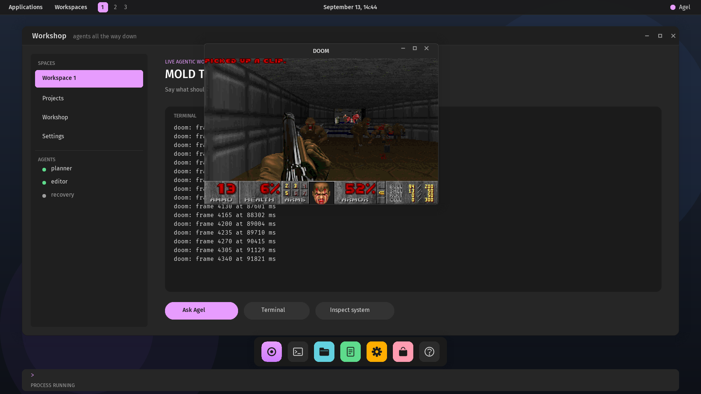
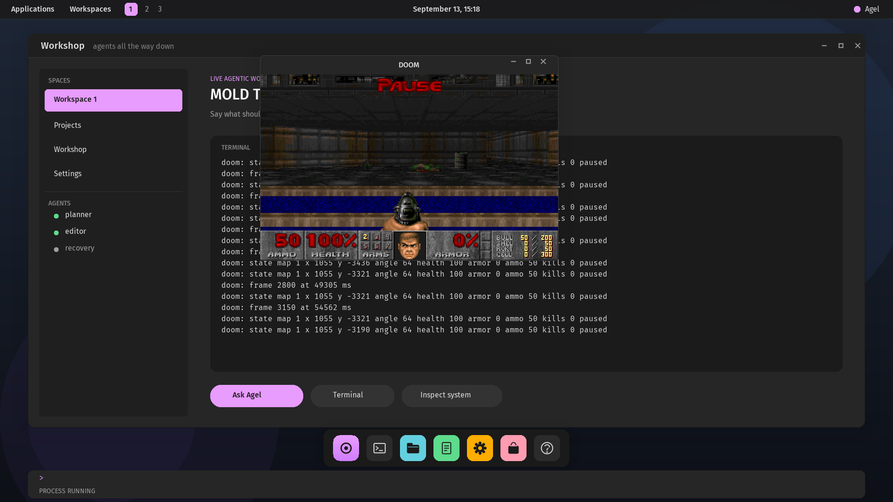

# Does it run DOOM?

**Yes, since v0.2.71.** The shareware episode's demo plays in a window
on the Agel desktop at 49 frames per second under QEMU's emulation, the
engine an ordinary C program in a protection domain, the data a
read-only file the filesystem service serves, every frame a canvas the
process draws and the compositor blits.



The question every system gets asked, taken as a research programme
rather than a stunt: DOOM runs as an ordinary POSIX process on Agel's own
kernel, and Agel plays it, with the whole loop (the game, the agent that
plays it, the data it leaves behind and the model trained on that data)
running under the same capability discipline as everything else here.
This document records what is known, what Agel lacks today, measured, and
the order of work. Each rung is one release with its own test; the state
of each line is kept in [`roadmap.md`](roadmap.md).

## What others have done

- **A language model plays it, slowly.** *Will GPT-4 Run DOOM?* (de
  Wynter, 2024, [arXiv:2403.05468](https://arxiv.org/abs/2403.05468))
  gave GPT-4V screenshots of the game, had it describe the state in text
  and choose keystrokes. It opened doors, fought and found paths "to a
  passable degree", forgot enemies that left the screen, and did better
  with several model calls per step. Each step took seconds: the game had
  to wait for the model.
- **A tiny trained model plays it in real time.** *Playing DOOM with 1.3M
  Parameters* (2026, [arXiv:2604.07385](https://arxiv.org/abs/2604.07385))
  trained a 1.3-million-parameter encoder on 31,000 human demonstrations
  of one scenario, fed it ASCII frames and depth maps, and had it choose
  an action every 31 ms. It scored 178 frags over ten episodes where every
  large language model tested together scored 13, and was the only agent
  that engaged enemies rather than fleeing. The lesson for this
  programme: judgement from a large model, control from a small one
  trained on data the system collected itself.
- **A model *is* the game.** *Diffusion Models Are Real-Time Game
  Engines* (GameNGen, 2024, [arXiv:2408.14837](https://arxiv.org/abs/2408.14837),
  ICLR 2025) trained an agent to play, recorded it, then trained a
  diffusion model to predict the next frame from past frames and actions:
  20 frames per second on one TPU, raters near chance at telling it from
  the game. A world model of this kind is what "predict future outcomes"
  means concretely: a learned simulator of DOOM under Agel's actions.
- **Reinforcement learning from pixels.** [ViZDoom](https://vizdoom.cs.put.edu.pl/)
  is the standard research harness; curiosity-driven exploration
  ([Pathak et al., 2017](https://proceedings.mlr.press/v70/pathak17a/pathak17a.pdf))
  and asynchronous training reached super-human play there, and world
  models (DreamerV3, *Nature* 2025) learn control in imagination from
  the same kind of frames-and-actions data. Unsupervised
  reinforcement learning (surprise, curiosity, skill discovery) is the
  right first objective when a human only says "learn to play it": the
  reward is the game's own progress, and exploration is intrinsic.
- **Low-frequency agents with tools.** The 2025 "Claude plays Pokémon"
  runs showed a model steering a game through screenshots, a memory it
  writes for itself and tools it calls, at one decision every few
  seconds, for days. That is the shape of the *judgement* loop here.

## What Agel has and lacks, measured

Where the port would run: `boot/posix`, the POSIX personality, C
programs against `agel-libc` in a protection domain on the desktop. All
80 sources of `doomgeneric` (the platform-free Chocolate Doom fork, GPL
v2) compile against Agel's C headers with two shim headers; what remains
is listed here exactly.

| Need | Agel today | Gap |
|---|---|---|
| Pixels on the screen | a window holds 24 records: rectangles, gradients, ellipses, labels, surfaces, sprites | no way to show a 320×200 frame a process rendered; a **pixel surface** record backed by pages the process draws into and the compositor blits, scaled |
| Keys | `EVENT_KEY` carries a byte on press; nothing on release | DOOM holds keys; **press and release events with key codes**, and modifiers |
| The program | ~1 MB of code and data | since v0.2.69 the program region is 4 MiB (sectors 2048–10239) in a 32 MiB image |
| The WAD | `doom1.wad`, the shareware data, 4.2 MB, read by `fopen`/`fseek`/`fread` | since v0.2.69 the data region (25.5 MiB, sectors 13312–65535) holds large read-only files served under `/data`; `agelfs` files stay 64 KiB |
| Memory | a 6 MB zone plus the WAD's cached lumps | since v0.2.68 a domain may hold any number of the pool's frames (a bitmap ledger) and the x86-64 pool is 46 MiB like the others'; the process window is 16 MiB, of which the top 1 MiB is the canvas |
| Floating point | `r_main.c` and `v_video.c` use `float` in a few places; `m_config.c` parses one with `atof` | since v0.2.70 the unit is the process's on x86-64 and AArch64, with `math.h` and `atof`; RISC-V stays soft-float |
| C library | `printf` family, streams, heap, strings, `getopt`, directories, time | closed in v0.2.70: `strcasecmp`, `fseek`/`ftell`/`rewind`, `remove`, `atof`/`strtod`, `system` (`ENOSYS`), `strings.h`, `inttypes.h`, `math.h` |
| Time | `clock_gettime`, `nanosleep` on a monotonic clock | enough: `DG_GetTicksMs`, `DG_SleepMs` |
| Sound | none | out of scope; DOOM runs silent |
| An agent that plays | model providers exist only in the **hosted** runtime, through a typed, audited effect; the native kernel has no network and no local inference | the agent runs hosted and drives the OS through the same QMP and serial channels the tests use, on the machine's own screen and keyboard; a native agent waits on networking or local inference, both open on the roadmap |
| Speed | under QEMU's TCG a full 1080p repaint costs 0.5 s; a 320×200 blit at 1× is 64 K pixels, ~16 ms; at 2× ~64 ms | real hardware (the Pi 5, a PC) is 20–50× faster; the design keeps the blit unscaled or 2× and repaints only the window |

## The design

1. **A canvas is a record that names pages.** A process asks the
   desktop for a canvas of W×H (`CANVAS`, protocol word 22); the
   supervisor allocates the frames into the process's domain, read-write,
   and maps the same frames into the compositor read-only, where a new
   record type blits them into the window at 1× or 2×. The process draws
   into memory and asks for a `DRAW` as now; nothing it writes can reach
   outside its window, since the compositor clips the blit like every
   other record. When the process ends, the compositor's mapping is
   withdrawn before the frames go back to the pool.
2. **Keys go down and up.** The input driver world reports make and
   break codes; the desktop turns them into `EVENT_KEY_DOWN` and
   `EVENT_KEY_UP` with a key code, keeps `EVENT_KEY` for the workshop's
   line, and delivers modifiers as keys like any other.
3. **Room.** The disk image grows to 32 MiB, with a program region of
   4 MiB and a **data region** (sectors installed from the host by
   `scripts/install-data.py`, a table like the program and asset
   regions) that the filesystem service serves as read-only files under
   `/data`, so `fopen("/data/doom1.wad")` works through the namespace.
   The frame ledger becomes a bitmap over the pool rather than a list of
   512, and the pool grows to what the machine has.
4. **A floating-point unit for processes**, on x86-64: SSE enabled for
   domains, the FPU state saved and restored around every domain entry,
   and a small `math.h`. On AArch64 and RISC-V the same switch, when the
   port reaches them.
5. **The port.** `boot/posix/c/doom/`: `doomgeneric` unmodified as a
   third-party source (GPL v2, its licence kept beside it) plus one
   platform file implementing `DG_*` over `agel/window.h`: the surface,
   the keys, the clock. Built by `scripts/build-c-program.sh doom`,
   installed with the WAD, started with `:exec c-doom`. The proof is a
   demo played back to a checksum: DOOM's own `-timedemo` reports its
   frame rate, and the test requires the title screen's pixels.
6. **Agel plays.** A hosted Agel agent (`crates/agel-cli`, the
   model-provider effect) holds a `Machine` like the tests do: it reads
   the frame by screendump, sends keys by QMP, and runs the game in
   **steps**, a fixed number of tics per decision, so a model that
   answers in seconds plays a game that runs at 35 Hz. Every step is
   appended to a **dataset**: the frame, the game's own state (from a
   `/data`-style channel DOOM writes: position, health, ammo, kills, the
   level), the action, the model's stated reason. The desktop shows the
   run: the game in its window and, beside it, a window a second process
   draws with the agent's state, the last reasons, the frame time, the
   pool's frames in use and the passes per second, as the roadmap's
   visualization line.
7. **A policy trained on the dataset**, small and fast, following the
   1.3M-parameter result: imitation from the model-played episodes
   first, then intrinsic-reward reinforcement learning (curiosity or
   surprise) against the game itself, then a world model for
   predictions of what comes next. Training is orchestrated, not
   performed, by Agel, as [`deployment-targets.md`](deployment-targets.md)
   decides: the trainer is a provider, reached through the same
   capability-scoped effect. The trained policy runs as a process on the
   OS when local CPU inference exists, and hosted until then.
8. **A human in the loop.** The hosted agent's run is a world with a
   message queue: the operator's text (or, later, speech transcribed by
   a provider) is appended as a message the agent reads between steps;
   side questions to a sub-agent read the run's own state and the world
   model's predictions without touching the run. This is what the agent
   runtime already does for any agent: mailboxes, supervision, event
   history, snapshots, replay.

## The order of work

Each rung is a release with a test; none starts before the one before it
is proved. The rungs and their state are listed in [`roadmap.md`](roadmap.md).

1. A canvas (design 1), proved by a C program that draws a moving
   pattern into it and a test that reads the pixels back: **v0.2.66**.
2. Key press and release events (design 2): **v0.2.67**.
3. Room: the bitmap ledger and the larger pool (**v0.2.68**); the larger
   disk and the data region (**v0.2.69**).
4. The C library's missing functions and floating point (design 4):
   **v0.2.70**.
5. DOOM runs, keyboard-playable on the desktop, `-timedemo` frame rate
   reported (design 5): **v0.2.71**, 49.4 frames per second under TCG.
6. Agel plays it, stepping, with the dataset (design 6): **v0.2.72**
   with the loop on the host, then **v0.2.74** with the loop an Agel
   program in the OS,
   the hosted agent; the run window on the desktop is open.
7. A trained policy from the dataset (design 7); a world model after.
8. Speech and steering (design 8).

## How it runs (v0.2.71)

`boot/posix/c/doom/` is `doomgeneric` (the platform-free Chocolate Doom
fork, GPL v2, its licence beside it) unmodified: eighty sources listed in
`c/doom.deps`, compiled with the defines in `c/doom.cflags`.
`c/doom.c` is the platform: `DG_Init` asks for a 640×400 window and a
320×200 canvas, `DG_DrawFrame` copies the engine's frame into the canvas
and blits it at twice its size, `DG_GetKey` turns the window's key
events into the engine's keys (arrows, control to fire, alt to strafe,
shift to run, space to use, escape and enter for the menus, a character
from the serial console as a tap), `DG_GetTicksMs` and `DG_SleepMs` are
the monotonic clock and `nanosleep`. `scripts/fetch-doom-wad.sh` fetches
`doom1.wad` once, pinned by digest; `scripts/test-doom.sh` builds the
image and the engine, installs both in a test disk and starts

```
:exec c-doom -- -iwad /data/doom1.wad -mb 8 -timedemo demo1
```

The desktop answers `PROCESS RUNNING`: a program that keeps computing
without ever listening or sleeping now gets the prompt handed back after
256 passes and is stepped between inputs like one that listens, so keys
reach it. To play: the same line without `-timedemo`, then click the
window and use the keys above; `-mb 8` gives the engine an 8 MiB zone
of the process's 16 MiB window.

What the port found on the way: the loader's cap of 128 pages (the
engine is 730 KiB), `seek` refusing offsets past the 64 KiB filesystem
file limit, a read spanning two sectors losing its first half to the
second's delivery into the block area, the data directory needing the
filesystem mounted before it could be named, and a wrapped exit status
in the report; each fixed in v0.2.71 with a test.

## Agel plays (v0.2.72)

The sixth rung, in its first form: a hosted agent plays the game on the
Agel desktop through the machine's screen and keys, deciding through
Agel's model-provider effect, and leaves a dataset of every step.



`crates/agel-play` is the agent, a Rust program on the host (Tier 2 in
[`deployment-targets.md`](deployment-targets.md)): it boots the desktop
image in QEMU with the monitor and serial sockets the tests use, formats
the region, starts the engine from the workshop (`-warp 1 -skill 2`), and
then steps. Each step: `p` pauses the game, the engine prints its state
line (`doom: state map 1 x 1055 y -3190 angle 64 health 100 armor 0 ammo
50 kills 0 paused`) and the panel under the window is repainted for it;
the agent captures the screen twice a quarter second apart and keeps a
frame the two agree on (the compositor paints straight into the
framebuffer, so a capture can catch a repaint half done); the window's
content becomes eighty by twenty-five characters of luminance; a policy
decides; `p` unpauses; the action's keys are held for the step's length
(300 ms) and released. Every step is one line of `steps.jsonl`: the
frame's path, the state, the action, the reason, the ASCII, and the
frame itself is kept as a PPM.

Two policies exist. **Scripted** is a fixed dance for tests, with no
model: `scripts/test-play.sh` runs eight steps and requires the dataset,
the engine's state in it, and a fire among the actions. **Claude** and
**Codex** decide through `agel-model`'s providers, the same typed,
audited `model/infer` effect the hosted runtime uses: the prompt is the
rules, the action list, the state, the last six steps and the ASCII
screen; the answer's `ACTION: <name> | REASON: ...` line is parsed into
one of ten actions (forward, back, turn-left, turn-right, strafe-left,
strafe-right, fire, forward-fire, use, wait), and anything else is
`forward` with the answer as the reason. A five-step run with Claude
Code on this machine walked north from the start of E1M1, each step
with a reason ("Dark opening ahead, keep advancing"), the engine's
coordinates confirming the walk; the run and its dataset are in the
release notes.

What the engine does for this: `p` is its pause key (the Pause key the
engine names cannot be delivered by the desktop's decoder), its own
fire, use and strafe keys are what control, space, comma and period
carry, its heartbeat is one line every ten seconds of game time and one
state line at each pause, because every console line repaints the panel
under the window; that alone took the timed demo from 49 to 170 frames
per second. The desktop repaints only the canvas for a window in front
whose one record is its blit, so no moment shows the window's surface
between two of a game's frames.

What this is not: the loop is Rust on the host, not an Agel agent in
the language, so the decision is an effect the host makes for the
provider rather than a message an Agel world sends; that is the next
form. The model reads shades, not pixels. One decision takes seconds
and the game waits paused for it, so this is judgement, not reflexes;
the trained policy of the next rung is for reflexes. There is no run
window on the desktop yet: the agent's reasoning is on the host, and
the engine's state lines in the terminal are all the desktop shows of
it. No steering while it runs, no speech.

## The loop in the OS (v0.2.74)

Now the loop is Agel, in the OS. The perceive-decide-act cycle is an Agel
program, [`boot/desktop/doom-agent.agel`](../boot/desktop/doom-agent.agel),
loaded into the desktop's own native evaluator with `:load doom-agent`
and run with `:play STEPS [HOLD]`. The desktop is the substrate the
language cannot be: each step it pauses the game with the key
`(play-pause)` names, samples the played window's canvas into a grid of
shades and copies the engine's last state line into the evaluator's
shared page, calls `(play-step)`, and injects the keys the returned form
names, holding them for the step. Rust observes and actuates; Agel
decides.

Six new native words give the language what it needs and nothing more:
`(look x y)` is one cell's shade and `(look-mean x y w h)` a block's mean,
over a sixty-four by twenty-five grid; `(look-line)` is the program's
last console line and `(look-field n)` the n-th integer in it, so the
agent reads `doom: state map 1 x 1055 y -3611 ...` as fields; and
`(model-request text)` with `(model-result)` let a step ask a model and
read its answer. They read a copy the desktop placed in the shared page,
never process memory or a device; a world that was given nothing to look
at answers with an error, and the request text is bounded to two hundred
bytes. The scripted `doom-agent` asks no model: it goes forward and
fires where the way is open, turns toward the darker (farther) half when
its position has not changed, and backs off when health is low, all in
its own forms.

`scripts/test-play.sh` proves it: it loads the Agel program, starts the
engine, and `:play 8` steps it, requiring eight `play: step` lines with
the keys the language chose, a state line it read, and a forward or fire
among them. No host policy and no model are in that path; the loop it
tests is entirely the Agel program's, in the OS. A command line still
reaches the workshop while the game holds the keyboard, because it opens
with a colon, so `:play` can be typed at a game in focus.

A model decides through the same words, in
[`doom-agent-model.agel`](../boot/desktop/doom-agent-model.agel): each
step it `model-request`s what it saw, and until an answer arrives it
holds nothing. The desktop prints the request, the state line and the
window as shades on the serial console between `model-request N:` and
`model-request end`, and reads the answer back as `:model-reply N <action>
<reason>`. `crates/agel-play` is now only that bridge: it boots the image,
loads the program, runs `:play`, and answers each request by calling a
provider through `agel-model`'s typed, audited `model/infer` effect,
recording every step to `steps.jsonl`; a `--policy echo` answers
instantly, for proving the round-trip without a model. The host makes the
model call the OS cannot yet make itself; the loop that asks, decides
what to do with the answer, and acts is the Agel program's. The request
with its observation and the reply are proven; driving a whole model
episode is by hand, not yet a tested path.

What this still is not: the model call leaves the machine, because the
native kernel has no network and no local inference; the shades are
coarse and a decision takes seconds while the game waits paused, so this
is judgement, not reflexes; there is no separate run window on the
desktop drawing the agent's reasoning, and no steering or speech yet. The
trained policy and the world model of the next rungs are for reflexes and
for prediction.

## The agent keeps its own log (v0.2.75)

The next rung toward self-hosting: what the loop needs beyond deciding is
handled by the Agel program too. Seven effect words let a program in the
OS reach outside its world through the desktop: `file-read`, `file-write`,
`file-append` and `file-list` are the filesystem region, `clock` the
machine's clock, `console-log` the console, and `exec` starts a program as `:exec`
would. `doom-agent.agel` now appends one line per step to `play.log`, the
engine's state line and its reason, with `file-append`, and
`scripts/test-play.sh` reads the log back with `file-read`, lists it with
`file-list`, and sees it in `:fs-ls`. The dataset of a scripted run is the
program's own file, written and read by Agel.

The mechanism is a synchronous port: the evaluator writes the request
into its shared page (the kind, three words, the text in the observation
area), yields to the supervisor, the desktop performs it against the
filesystem service, the clock driver or the console and writes the answer
in place, and the world resumes inside the word. No effect touches the
world's transaction: a request made by a form that then fails is not
undone (a file written stays written), which is what an effect is; the
words say so in their names.

What this is not: the words are available to every form the desktop
evaluates, as `:fs-ls` is to every operator; a capability a world must
hold to write is the next step. v0.2.76 raised the evaluator's bounds so a
program can be kilobytes rather than a postcard.

### Built where CI builds (v0.2.73)

v0.2.71 and v0.2.72 passed every suite here and failed the DOOM suite on
CI: the engine faulted after `ST_Init`, touching the low 32 bits of a
data address. The runner's clang 18 references data through the GOT
(`add S_music@GOTPCREL(%rip), %r15`), and its lld 18, linking a static
program that is not `-pie`, relaxes that to `add $S_music, %r15`, an
absolute 32-bit immediate that cannot hold an address at 512 GiB and is
silently truncated; Homebrew's newer lld keeps the load. The binary the
runner builds was reproduced in an Ubuntu 24.04 container, faulted on
QEMU here in `S_ChangeMusic` at the same instruction, and the fix was
proved there: C programs now compile with data reached directly
(`-fdirect-access-external-data`) and link `--no-relax`, so no GOT entry
becomes an immediate on any lld. The same run showed the engine's last
line printing `%f`, so the library's `printf` now formats floating point.

## What this is not

Sound is out of scope: the engine is built without it. RISC-V has no
floating-point unit here, so the port is for x86-64 and AArch64; on the
Pi it waits for USB input, since the serial console gives taps, not held
keys. The frame rate is QEMU's TCG on one core of a laptop, not a
measurement of the design. Saving the configuration on exit writes into
the filesystem region, which fails harmlessly when it is not formatted.
The native kernel has no network and no local inference, so the agent
that plays is hosted, as [`deployment-targets.md`](deployment-targets.md)
calls Tier 2, until those lines close. DOOM's source is GPL v2 and stays
a third-party program beside Agel's code, not part of it.
