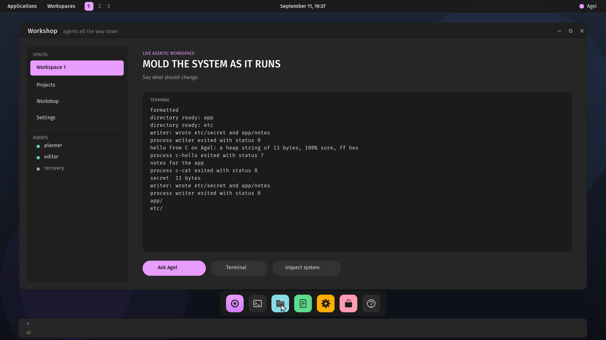
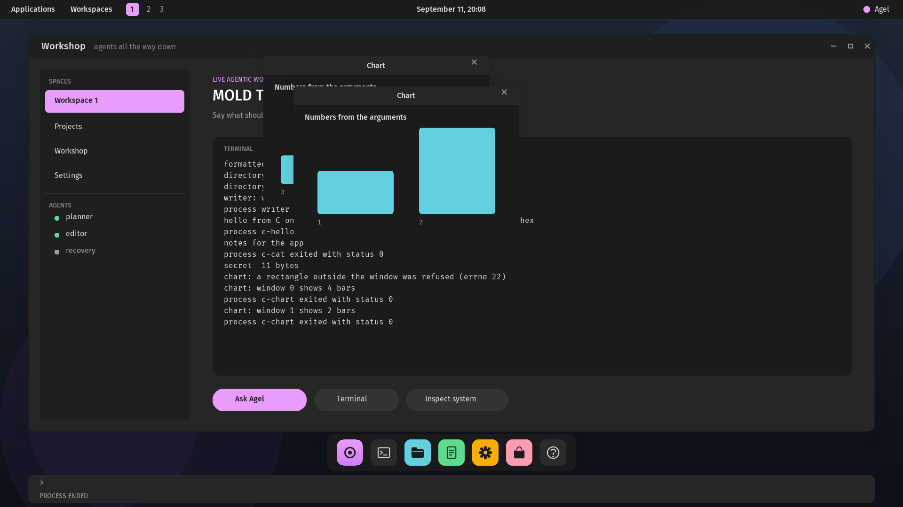
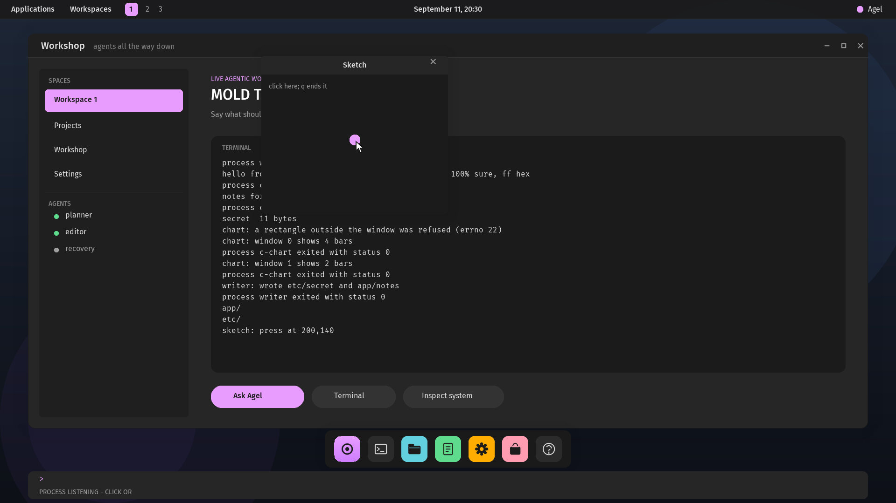
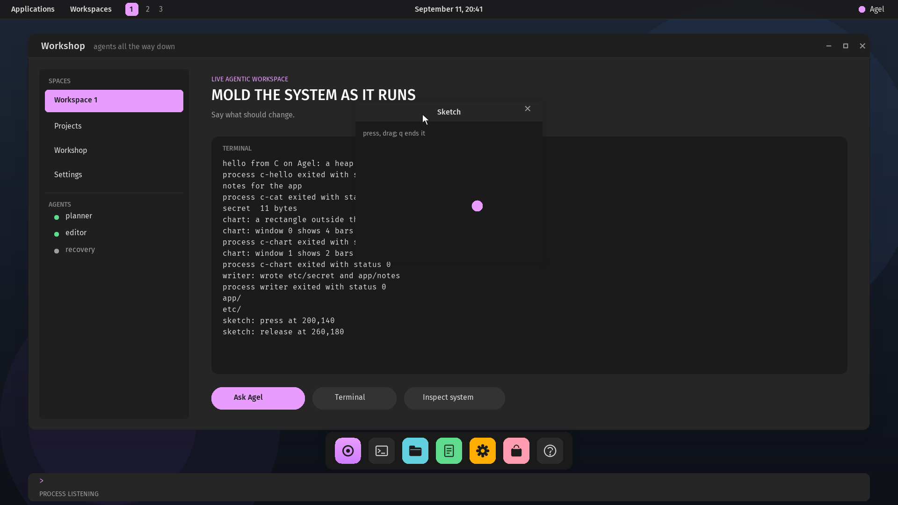

# Native Agel graphics

Agel boots to a live graphical workshop in QEMU, at 1920×1080×32 since
v0.2.48 (1024×768 before it, and still when the display cannot be set). The path
is deliberately split so that visual meaning remains language data and display
authority remains a narrow replaceable service:

```text
Agel vector source
  → bounded build validator
  → immutable 64-byte command records
  → supervisor envelope validation
  → ring-3 compositor revalidation
  → VBE framebuffer
```

Run it:

```sh
./scripts/run-graphics.sh
```

The default launcher boots into QEMU's own native window. `--web` optionally
opens a local browser console with the real QEMU
framebuffer and a host text field. Use your Slovak/macOS layout, Option symbols,
dead keys, and Command-V paste there; Enter or **Run in Agel** submits one line
to the guest. Clicking the image focuses the field without capturing your
mouse. Stop the viewer and QEMU with Ctrl-C in the launching terminal. The disk
is persistent: `:save` publishes source cells replayed on the next boot.

`./scripts/run-graphics.sh` (equivalently `--native`) uses QEMU's direct window and serial
terminal input. The launcher validates its flags, accepts `--workbench`, `--native`,
`--web` and `--help` in any order, rejects anything else, and passes arguments
after `--` to QEMU. This physical PS/2 path uses a US layout, now including all
ASCII punctuation, uppercase, Caps Lock, independent Shift keys, and Ctrl-U/C
to clear the line (Ctrl-H backspaces). It does not inherit macOS text layout or
Option dead-key composition. QEMU's Cocoa frontend controls mouse capture;
its release shortcut is Control-Option-G by default (see QEMU's View menu and
the [QEMU frontend keys](https://www.qemu.org/docs/master/system/keys.html)).

The browser console is explicitly a host input bridge, not a native browser
inside Agel. It binds only to loopback with a random session URL, checks POST
origins, and exposes bounded text submission and framebuffer capture. It has
no arbitrary command execution endpoint. Every form still executes in Agel's
isolated evaluator, with 256 UTF-8 bytes per input. Source and the host
transcript preserve Unicode; the seed framebuffer font uses `?` for unsupported
bytes. Characters such as `≤` are not automatically new language operators.

## Typography, surfaces and assets (v0.2.47), native resolution and sprites (v0.2.48)



The compositor draws from three more record operations, each validated
like the others:

| Operation | Words | What it draws |
|---|---|---|
| `label` (6) | x, y, face, size, colour, alpha, length; text at byte 36 | anti-aliased text from a font atlas, blended over what is below |
| `surface` (7) | x, y, width, height, radius, colour, alpha | a rounded box blended with an alpha, its corners anti-aliased |
| `shadow` (8) | x, y, width, height, radius, blur, alpha | a linear falloff around a box, drawn as rings, the box itself left alone |
| `sprite` (9) | x, y, sprite, tint, alpha | a sprite from the sheet, blended by its own alpha; in `tint` when that is not black, so one white glyph serves every colour |

The faces are font atlases in the disk's **asset region** (sectors 3072
through 6143, a table like the program region's). `scripts/build-font-atlas.py`
rasterizes a TrueType font with Pillow into `AGF1`: for each pixel size,
the 96 printable ASCII glyphs with their metrics and 8-bit coverage
bitmaps. Fira Sans Regular and Medium (12 to 32 px) and Fira Mono (12 to
20 px), bundled under the SIL Open Font License in `boot/desktop/fonts`,
are rasterized by `scripts/build-assets.sh` into `boot/desktop/assets`,
which is committed: every build and every CI run installs the same bytes,
so the self-test's frozen digest means the same thing everywhere, and no
build needs Pillow. Change a font, a size or a sprite, run the script,
refreeze the digest. At boot the graphics supervisor reads each atlas
through the storage driver domain, checks its CRC-32, maps it read-only
into the compositor's asset window, and keeps the metrics it needs to lay
text out; the compositor checks every offset an atlas names against the
length it was told before reading it. The graphics image refuses to boot
without its faces. The sprite sheet (`AGI1`, RGBA8) is drawn by
`scripts/build-sprites.py` with Pillow at four times its size and scaled
down: the arrow cursor, seven dock icons, the three window controls and a
search glyph.

Since v0.2.48 the supervisor sets the display to 1920×1080×32 through the
Bochs display interface QEMU's standard VGA exposes (two I/O ports), keeping
the linear framebuffer the BIOS mode reported; where the interface is absent
the BIOS mode stays and the scene is scaled into it, with text unscaled,
which is a limit of that fallback rather than the design. The scene is laid
out at 1920×1080; the language's drawing region is 1920×1000, above the
command field. The pointer is the cursor sprite. Painting drains the input
driver between records into a queue the session reads first, so keys typed
while a frame is painted are kept: a frame of blended surfaces is slow
under emulation, and before this the controller's buffer overran.

The scene in `boot/desktop/native-desktop.agel` uses COSMIC's tokens: its
dark palette (`#1b1b1b`, `#262626`, `#333333`, text `#dedede` and
`#9e9e9e`, accents `#e79cfe`, `#63d0df`, `#ffad00`), corner radii of 8 and
16 pixels, spacing in steps of 8. A top panel with workspaces, the workshop
window with a title bar, a sidebar of spaces and agents, two cards and three
actions, a floating dock of six tiles, and the command field in Fira Mono.
The accent intents recolour every accented record.

Drawing is bounded by a **clip rectangle** the supervisor sets in the
shared page: a keystroke redraws the command field, a pointer that moved
redraws the union of where it was and where it is, and only a committed
scene change redraws the screen, so input is not lost to painting.

## Programs on the desktop (v0.2.49)

The graphics image carries the process loader and the filesystem service,
so the graphical workshop runs programs: `:exec NAME [ROOT] [ro] [-- ARG...]`,
`:fs-format`, `:fs-mkdir PATH`, `:fs-ls [PATH]` and `:fs-restart` mean what
they mean in the serial workshop, through one shared implementation in the
kernel's `workshop` module, with the console a trait either workshop
supplies. On the desktop a process's console is a tee: the serial console
driver, which the harness reads, and a **terminal panel** in the workshop
window, sixteen rows of eighty-four columns in Fira Mono, scrolling, drawn
by the supervisor from the scene like everything else. What a process
writes appears there as it writes it; how it ended is the last line.

## A desktop that responds (v0.2.50)

The pointer does things. What it is over says so: a dock tile lightens,
the panel's "Applications" gets a pill, a launcher entry a row. A click on
"Applications" (or the Agel and store tiles) opens the **launcher**, which
lists the program region's names; a click on a name runs it, as if
`:exec NAME` had been typed, so the serial console shows it too. The
terminal tile clears the panel, the files tile lists the root, the settings
tile cycles the accent, the help tile prints the help. Every click is a
typed command underneath; there is no second path into the system.

The panel's centre is a **clock** from a driver domain: `agel_clock_main`
holds the two CMOS ports and nothing else, answers the supervisor with the
real-time clock decoded from BCD, and is read at boot and while the
session is idle; the label is repainted only when its minute turns. The
serial console prints `clock: YYYY-MM-DD HH:MM` at boot.

A burst of pointer packets is coalesced into one repaint, and a large move
sent as one event loses packets to the controller's queue, as a real
mouse never sends one; the tests move in steps.

What this was not yet: a process could not own a window or draw into one;
it wrote text into the workshop's terminal and nothing else. The editor
tile does nothing. The shadow is a linear falloff, not a blur.

## Windows a process can own (v0.2.51)

A process asks the supervisor for a window and draws into it, and the
supervisor keeps what it drew:



The process protocol gains two requests, `10` **window** and `11`
**draw** (the table is in [`posix-personality.md`](posix-personality.md)).
A window is content of a requested size, 64×48 up to 1280×720, under a
header the desktop draws: the title in Fira Sans Medium, a close control
from the sprite sheet, COSMIC's surfaces and radius, a shadow. Windows
cascade from the workshop's upper left; the desktop keeps two.

A draw request carries up to eight 64-byte compositor records in the
process's block area, in the coordinates of the window's content. The
supervisor **checks every record before anything is painted**: the
operation must be one a window admits (a rectangle, a gradient
rectangle, an ellipse, a label, a surface, a sprite; never the full-screen
gradient, never a shadow), the colours 24-bit and the alphas at most 255,
the face and sprite index ones the atlases carry, and the whole shape must
lie inside the content, a label measured in its face. One record that
fails refuses the request with `-EINVAL` and nothing of it is drawn. The
records that pass are appended to the window (at most 24; a request past
that is `-ENOSPC`; `DRAW_CLEAR` empties the window first) and kept **by
the supervisor**, translated to the window's place when the frame is
materialized, so a window is repainted with the desktop like every other
surface, and outlives its process. A process may draw only into a window
it asked for, while it runs: the process table names the drawing process
by its slot, and when the process ends the window's owner is cleared, so
a later process in the same slot is refused with `-EBADF`.

Painting is regional: opening a window paints its box with the shadow
once; each draw repaints the box without the shadow, so the shadow is
never blended twice, and the pointer is redrawn when it is over the box.
The close control lightens under the pointer; a click on it is the typed
command `:close N`, which the operator can also type; `:close` answers
`WINDOW CLOSED N` or `NO SUCH WINDOW`. A click anywhere else on a window
belongs to the window and does nothing on the desktop beneath. The scene
transaction leaves windows and the terminal alone: `(rollback)` restores
the language's scene, not what processes made. The frame's record budget
grows from 160 to 224 for two windows and the launcher at once.

The serial workshop has no display: a window request there answers
`-ENODEV`, and `chart` says so and exits with 3.

From C, `<agel/window.h>` declares `agel_window` and `agel_draw` and
inline builders for the six record kinds; `boot/posix/c/chart.c` draws a
bar for each number on its command line and, given `outside`, first asks
for a rectangle past the edge and reports the refusal.
`scripts/test-desktop-process.sh` runs it twice, requires the refusal
and both windows' bars on the screen (the bars' colour appears inside the
windows' boxes and nowhere there before), closes the second by clicking
its close control and the first by `:close 0`, and requires the bars
gone; `scripts/test-libc.sh` requires the `-ENODEV` answer on all three
machines.

What this was not yet: a window received no input, and a process ran to
its end before the desktop took the next input. Windows do not move,
resize, stack by click or overlap the launcher; the workshop is not
itself a window. Two windows, 24 records each.

## A window that listens (v0.2.52)

A process can wait for its window and keep running beside the desktop:



The process protocol gains `12` **event**: the next event queued for a
window the process owns, packed in one word (the kind in the top byte, a
press's content coordinates or a key's byte below), 0 when there is
none; with its second argument set the process **sleeps until there is
one**. Each window keeps eight events, oldest first; a ninth drops the
oldest. A press in a window's content queues a press for its owner, and
the window takes the **keyboard**: from when it opens or is clicked until
the workshop is clicked, a key typed (serial or PS/2) is an event for
the window's live owner rather than a byte of the workshop's line. A
window whose process has ended queues nothing and gives the keyboard
back.

For this the process table runs in **passes**: `process::start` loads
the program, `step_run` gives every runnable process one entry and every
blocked one a chance to be answered, and reports whether something moved,
whether every live process waits for the desktop, or how the first ended;
`finish` gives the frames back. The serial workshop loops over passes as
it always did, and a process that waits for an event there, where nothing
can deliver one, is stopped as blocked like a deadlock. The graphical
workshop runs `:exec` to its end as before **unless the program
listens**: then the command answers `PROCESS LISTENING`, the prompt
returns, and the desktop runs sixteen passes between inputs while the
program lives, repainting the terminal panel when the program wrote and
the whole frame, with the report and a fresh prompt, when it ends. The
process serves `write`, `draw` and its children the same way in either
mode; a second `:exec` while one runs is refused with
`A PROCESS IS RUNNING`.

`boot/posix/c/sketch.c` opens a window, waits for events, puts a dot
where each press lands and writes the press to the console; a key clears
the dots, `q` ends it. `scripts/test-desktop-process.sh` runs it,
requires the prompt back with `PROCESS LISTENING` and no exit, presses in
the content, reads `sketch: press at 200,140` on the serial console and
the dot's colour where the press landed, sends `q` on the serial console
and reads the quit, the exit report and `PROCESS ENDED`, and requires the
dot still there until `:close 0`.

What this was not yet: no pointer release or motion events; windows did
not move or stack. A process that computes without listening still holds
the desktop until it ends; one running program at a time; sixteen passes
per idle turn is a fixed budget, not a scheduler.

## Windows that move (v0.2.53)

Windows behave like windows:



- **A press in a header takes hold of the window.** While the button is
  held the window follows the pointer, clamped to the screen below the
  panel; the place it left and the place it reaches are repainted
  together, with the shadow's margin, and nothing else. The release lets
  go.
- **A press on a window brings it to the front.** The scene keeps the
  windows' order, back to front; the frame paints them in that order and
  the hit test walks it from the front, so a covered window's content is
  not clicked through the one above. A new window opens in front.
- **After a press in a window's content, the pointer is the window's
  until the release.** The owner receives the motion, coalesced to the
  latest position so a slow reader sees where the pointer is, and then
  the release, both in content coordinates (clamped, as the pointer may
  leave the content while held); `EVENT_RELEASE` and `EVENT_MOTION` join
  the protocol. Nothing else on the desktop sees the held pointer.
- The pointer decoder reports whether the button is held, so a release
  is a packet with the button up after one with it down.

`sketch.c` now moves the dot with the pointer until the release fixes it.
`scripts/test-desktop-process.sh` presses in the window, drags, requires
the dot to follow with no trace behind, reads the release on the console,
drags the window by its header and requires the dot to have moved with
it and the old place repainted, opens a chart over it and requires the
dot covered, clicks the sketch and requires it back in front.

What this is not yet: no resize, no maximize or minimize (the sprite
sheet has the controls; nothing answers them), no motion events without
a press, no modifier keys; windows cannot be moved over the panel or off
the screen.

## Depth (v0.2.54)

Three things COSMIC's surfaces have that the desktop's lacked:

- **A shadow that tails off.** The compositor's shadow record paints
  rings of a black box growing outward; each ring's weight is now the
  square of its distance from the edge rather than linear, so a pixel
  `d` out carries the sum of the rings beyond it: dense at the box,
  tailing off softly, as a Gaussian blur of the box would. Windows and
  the launcher use a 32-pixel blur. The graphics self-test's digest is
  refrozen for the new falloff.
- **An edge.** A window and the launcher sit on a lighter box one pixel
  larger, so their edge reads against a dark surface below them, as
  COSMIC's one-pixel border does.
- **Press states.** The control under a held button darkens: a dock
  tile, "Applications", a launcher entry. The scene keeps what is
  pressed until the release, and the release repaints only that control.
  `scripts/test-desktop-process.sh` holds the button on the files tile,
  requires its brightness to drop by more than a tenth while held and to
  recover on release.

What this is not: a real Gaussian (the rings are a radial sum, not a
separable convolution), and no frosted or translucent panels, which need
a blur of what is beneath that the compositor does not have.

## Window controls (v0.2.63)

The header's three controls do what their icons say, and windows resize:

- **Maximize** fills the screen below the panel (1920 by 920 of content)
  and a second press restores the box the window had; **minimize** hides
  the window and leaves a **pill** with its title in the panel, which
  brings it back in front; **close** as before. Each is the typed command
  it always was: `:maximize N` (which also restores), `:minimize N`,
  `:restore N`, `:close N`, echoed on the console when clicked.
- **A press in the content's bottom-right corner** (sixteen pixels) takes
  hold of the size: the content follows the pointer while the button is
  held, from the window's minimum up to the screen's edge, repainted
  where it was and where it is.
- **The owner is told.** After a maximize, a restore or a corner drag,
  the owner receives `EVENT_RESIZE` (5) with the content's new width and
  height, so a listening program can lay itself out again; `sketch.c`
  does, and reports the size. What the process drew before stays kept,
  and a window made smaller paints only the records that still fit its
  content, checked as they were when drawn.

`scripts/test-desktop-process.sh` maximizes the sketch window, reads
`sketch: resized to 1920x920` and a header pixel where the wallpaper was,
restores it and reads `400x300`, minimizes it and finds the pill, clicks
the pill and finds the header back, drags the corner and reads `500x350`
and the header wider than before.

What this is not: no snapping, no keyboard shortcuts for the controls,
no double-click on the header, and the maximized size is the screen's,
not a chosen one.

## The desktop on a board (v0.2.62)

The graphics image builds for AArch64 and runs on QEMU's Raspberry Pi 4:
the framebuffer from the firmware's mailbox, the compositor domain with
the framebuffer mapped as normal uncached memory, the scene and the
assets as on x86-64, input from the serial console only. What the
machine decides is in one place per machine: how the framebuffer is
found (VBE and the display interface on x86-64, the mailbox on a board),
whether there is a keyboard controller and a clock. See
[`raspberry-pi.md`](raspberry-pi.md).

## Live Agel forms

The first native scene language is intentionally postcard-sized:

```lisp
(accent violet)
(accent cyan)
(accent amber)
(workspace 1)
(workspace 2)
(workspace 3)
(title "MY AGENTIC WORKSPACE")
(inspect)
(rollback)
(help)
```

Both input adapters produce the same bounded byte stream. The visible line
editor has the evaluator's 256-byte input budget; titles are 1–28 ASCII letters, digits,
spaces, or hyphens. Escape clears the line and Backspace edits it.

A mutating form is decoded into a semantic intent rather than a drawing
command. The supervisor derives a complete candidate vector frame from the
immutable Agel baseline, and the ring-3 compositor revalidates every record.
Only a successful complete render with a nonzero framebuffer digest advances
the revision. Syntax or policy rejection leaves the retained scene unchanged;
only the isolated diagnostic command bar is redrawn to report the rejection.
`(rollback)` swaps the current and preceding semantic scenes and renders the
restored value without rebooting.

These visual forms are the tiny scene-control surface. Every other Lisp form is
sent through a bounded shared page to the existing native evaluator in a
separate ring-3 domain. For example:

```lisp
(def square (fn (x) (* x x)))
(square 12)
```

The result appears both in the graphical command bar and on serial. A language
error rolls back its evaluator transaction without changing the desktop.

The same evaluator now owns bounded executable agents. A behavior definition can
be persisted as a cell, replayed on boot, and instantiated from the desktop:

```lisp
:cell accumulate (def accumulate (fn (self state message) (+ state message)))
:save
(def counter (spawn accumulate 0))
(send counter 42)
(step)
(agent-state counter)
```

Agent state and mailboxes participate in native world transactions; failed
behavior turns are contained and explicitly recoverable. See
[`native-agents.md`](native-agents.md).

## Durable source cells

Since v0.2.10, ordinary evaluated Agel can build a live vector overlay through
`scene-clear`, `scene-rect`, and `scene-count`. The dock library, actor-driven
redraw, bounds, and persistence walkthrough are in
[`native-scenes.md`](native-scenes.md).

The graphical workshop owns the same crash-tolerant source format as the serial
workshop:

```text
:cell mathematics (def triangular (fn (n) (/ (* n (+ n 1)) 2)))
:run mathematics
(triangular 100)
:workspace
:save
```

`:cell NAME FORM` stages one bounded named form. `:run`, `:show`, `:delete`,
`:cells` and `:workspace` inspect and manipulate that source workspace. `:save` resets the
evaluator and successfully replays every staged cell before publishing an
alternating, CRC-checked raw-disk slot. A failed form or failed write restores
the preceding committed evaluator. On boot, the newest structurally valid and
semantically replayable generation wins; a broken newest generation falls back
to its twin.

This is deliberately source persistence, not a memory dump. Authority-bearing
state, device handles, evaluator stacks, and Rust layouts never cross a reboot.
See [`examples/graphical-workshop.txt`](../examples/graphical-workshop.txt) for a
complete session. `:help` prints the self-documenting command postcard; since
v0.2.22 its length is checked at build time against the status line, so it can
no longer be silently truncated.

## Device handoff

The 512-byte BIOS seed asks SeaBIOS for QEMU's 1024×768×32 linear VBE mode while
firmware calls are still possible. It leaves the mode-information block and an
explicit success marker in fixed low memory. Graphics failure never prevents
the serial recovery path from booting.

After enabling page-table isolation, the supervisor validates mode attributes,
pixel format, pitch, dimensions, physical address, checked byte length, and a
16 MiB upper bound. It maps only the framebuffer's physical pages into the
display domain. The mapping is user-writable, non-executable, and cache-disabled;
no ordinary world receives a translation for it.

## Agel-owned native frame

[`boot/desktop/native-desktop.agel`](../boot/desktop/native-desktop.agel) is the
default graphical shell. It is ordinary Lisp syntax containing a logical
viewport and vector operations: vertical gradients, rounded rectangles,
gradient rounded rectangles, ellipses, and resolution-independent procedural
cell text. Edit that file and rebuild to change the native desktop without
editing the compositor.

The build adapter is intentionally not presented as the full Agel evaluator. It
accepts only this postcard-sized, allocation-bounded vector form, enforces
operation arity, colors, text encoding and length, and a 256-command maximum,
then writes deterministic fixed-size records into the boot image. The full
hosted `agel/vector` library remains richer; closing that bootstrap gap is later
work.

## Compositor containment

The software rasterizer executes at ring 3. Each 64-byte record arrives through
the existing bounded shared page and is validated again. Drawing is clipped to
the declared surface, arithmetic is widened or saturating where appropriate,
and every command yields independently so the preemption budget applies.

The graphical tests prove these properties:

1. 82 Agel vector commands produce the fixed framebuffer digest
   `0xdb1898cb6a32adc7` (31 commands and `0x71acd98bb55c3d9f` before the
   v0.2.47 restyle).
2. An unknown vector operation is rejected and the digest remains identical.
3. A deliberate write to supervisor memory page-faults; a replacement display
   domain maps the same device and observes the unchanged last-good digest.
4. A semantic candidate changes the framebuffer, a rejected candidate does
   not, and rollback returns to the exact original framebuffer digest.
5. Real serial input commits several changes while invalid input is rejected.
6. QEMU-injected PS/2 scan codes become `(accent cyan)`, commit revision 1, and
   produce a real PPM framebuffer capture.
7. Ordinary Lisp definitions evaluate in the independent evaluator domain.
8. A named source cell is saved, the machine exits, the same disk reboots, and
   the restored definition evaluates to the expected result.
9. A native actor runs transactional mailbox turns in the graphical workshop;
   its persisted behavior is replayed and spawns a fresh actor after reboot.

Run the headless proof with:

```sh
./scripts/test-graphics.sh
./scripts/test-live-desktop.sh
./scripts/test-graphical-workshop.sh
./scripts/test-live-keyboard.sh
python3 scripts/test-graphical-console.py target/boot/agel-v1.img
python3 scripts/test-native-dock.py target/boot/agel-v1.img
```

The framebuffer backend is currently a scalar software reference renderer. It
is deterministic and bounded, not yet GPU accelerated or optimized with SIMD.
A later accelerated service can consume the same language-owned contract
without moving UI hierarchy, actions, customization policy, or agent authority
into the driver.

## What is next

The next step is a language-owned graphical editor: multiline source cells,
selectable transcript history, pointer focus through semantic hit-test requests,
and preview/commit of a scene cell without leaving the desktop. Since v0.2.27
raw input already enters through restartable driver domains: serial bytes
through the console driver and keyboard/pointer bytes through an 8042 driver
granted only ports 0x60 and 0x64. Scan-code decoding, packet assembly and
every policy about what a key means stay in the supervisor, and the drivers
hold no UI authority.
