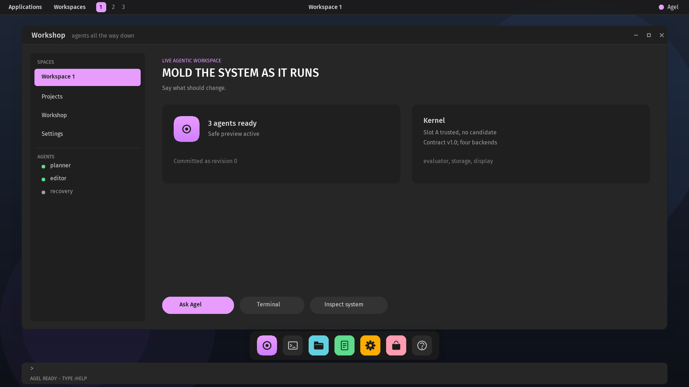

# Agel v0.2.48 — Native resolution and sprites

The desktop now runs at 1920×1080, draws its cursor, dock icons and window
controls from a sprite sheet, and keeps every keystroke typed while a frame
is being painted.

## What changed

- **1920×1080×32.** The graphics supervisor probes the Bochs display
  interface that QEMU's standard VGA exposes and sets the scene's size
  through it, keeping the linear framebuffer the BIOS mode reported. Where
  the interface is absent the BIOS mode stays and the scene is scaled into
  it. The scene is laid out at 1080p in COSMIC's tokens; the language's
  drawing region is 1920×1000, above the command field.
- **A sprite sheet.** `scripts/build-sprites.py` draws the arrow cursor,
  seven dock icons, the three window controls and a search glyph with
  Pillow at four times their size and scales them down; `AGI1` is installed
  in the asset region beside the fonts. A `sprite` record draws one,
  blended by its own alpha, in a tint when one is given. The pointer is the
  cursor sprite; the dock's tiles carry real icons; the title bar's controls
  are glyphs.
- **Input outlives painting.** Painting drains the input driver between
  records into a 256-entry queue the session reads first. A frame of
  blended surfaces is slow under emulation, and before this the
  controller's buffer overran while a frame was drawn.

## Proof

`scripts/test-graphics.sh` requires the 1920×1080 mode, the sprites to
load, and the frozen digest of the 78-record frame; the keyboard suite
types two forms across a full repaint and requires both intact; the
workbench suite clicks the widget at its coordinates on the larger screen;
the dock, console and module suites run at the new geometry.

## Not claimed

The fallback mode scales geometry but not text. The sprites are the
project's drawings, not COSMIC's icon theme. There are no windows a process
owns, no launcher behind the panel's words, and no clock.
