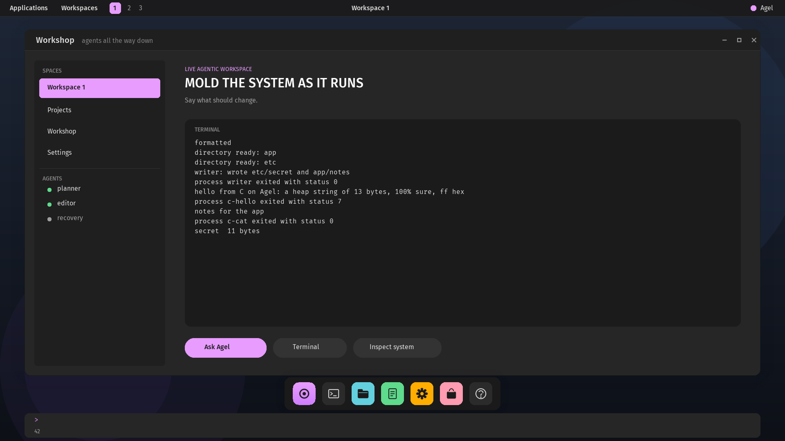

# Agel v0.2.49 — Programs on the desktop

The graphical workshop runs programs. The graphics image now carries the
process loader and the filesystem service; `:exec NAME [ROOT] [ro] [-- ARG...]`
and the `:fs-*` commands work as they do on the serial workshop, and what a
process writes appears in a terminal panel in the workshop window as it is
written.

## What changed

- **One workshop module.** The exec and file commands moved out of the
  serial workshop into `boot/kernel/src/workshop.rs`, over a `Console`
  trait the process protocol writes to; the serial console driver
  implements it, and the desktop implements it as a tee to the serial
  driver and to the terminal panel.
- **A terminal panel.** Sixteen rows of eighty-four columns in Fira Mono
  inside the workshop window, scrolling, bounded, drawn from the scene by
  the supervisor; it replaces the placeholder cards.
- **The size-era gates are gone.** Frame reclamation and the process
  machinery compile into the graphics image; the kernel slot has room.
- **`:fs-restart` on the desktop** as well, with the generation reported.

## Proof

`scripts/test-desktop-process.sh` builds the graphics image and three
programs (the Rust `writer`, the C `hello` and `cat`), installs them, and
drives the graphical workshop over its serial console: format, two
directories, the writer, the C program's `printf` line and exit status,
`cat` in a namespace reading the writer's file, a listing, and a check
that the terminal panel's pixels changed. The graphics self-test's digest
is refrozen for the 67-record frame. CI runs it.

## Not claimed

A process cannot draw into a window of its own; it writes text into the
workshop's terminal. The terminal gives a process no input. Nothing in the
panel is selectable or scrollable by the pointer.
