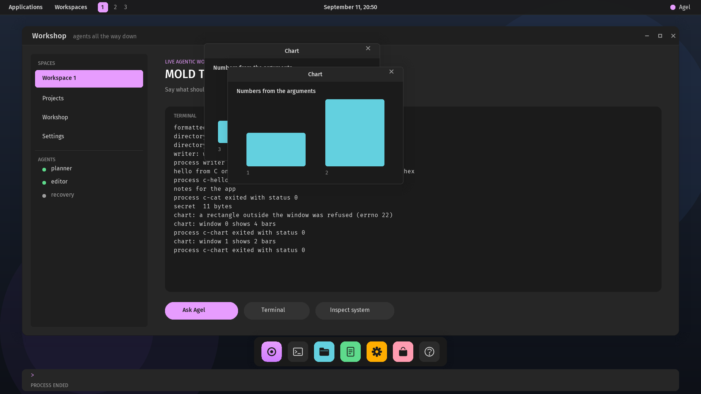

# Agel v0.2.54 — Depth

Soft shadows, one-pixel edges and press states.

## What changed

- **Shadows tail off.** The compositor's shadow rings are weighted by
  the square of their distance from the box, so the shadow is dense at
  the edge and fades softly, as a Gaussian blur of the box would.
  Windows and the launcher use a 32-pixel blur. The graphics self-test's
  frozen digest moves to `0x5a2398dd70437c00`.
- **Edges.** A window and the launcher sit on a lighter box one pixel
  larger, so the edge reads against a dark surface below.
- **Press states.** The control under a held button darkens: a dock
  tile, "Applications", a launcher entry; the release repaints only that
  control.

## Proof

`scripts/test-graphics.sh` requires the refrozen digest.
`scripts/test-desktop-process.sh` holds the button on the files tile,
requires the tile's brightness to drop by more than a tenth while held,
and to recover on release. The full regression passes.

## Not claimed

The shadow is a radial sum of rings, not a separable Gaussian
convolution. No frosted or translucent panels: the compositor has no
blur of what is beneath a surface.
