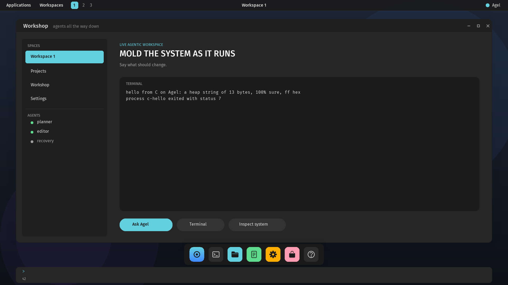

# Agel v0.2.62 — The desktop on a board

The graphical workshop runs on QEMU's Raspberry Pi 4: the framebuffer
from the firmware's mailbox, the compositor an AArch64 domain, the scene
painted, commands from the serial console, a program run from the card.

## What changed

- **The framebuffer from the firmware.** One property message through
  the mailbox at bring-up, before any world runs: size 1920×1080, depth
  32, blue in the low byte, a page-aligned allocation, the pitch. The
  answer is checked and its bus address turned physical; the message's
  static is cleaned from the cache around the call.
- **The compositor domain on AArch64.** `new_display` maps the
  framebuffer into the domain at a display window as **normal uncached
  memory**, a third memory attribute, so pixels are written at any width
  and seen as written; the compositor's text is in the user section on
  this machine too; the asset windows are where they are on x86-64.
- **What is x86-64's stays there:** VBE discovery and the display
  interface, the keyboard controller driver and the pointer, the CMOS
  clock, and the kernel slots are compiled only on x86-64. A board's
  input is the serial console and its panel shows the workspace.
- `build-kernel.sh raspi4 --features native-graphics` is the desktop as
  a flat image; the Pi 5 layout carries its mailbox address, unverified.

## Proof

`scripts/test-raspi4-desktop.sh` builds the image, makes a card with the
fonts, the sprites and `c-hello`, boots the board with it, requires
`AGEL_GRAPHICS_OK`, reads the frame back through QEMU's screendump
(1920×1080; the panel's grey, the workspace pill's exact violet, which
also proves the colour order), commits `(accent cyan)` and sees the pill
turn cyan, runs `c-hello` from the card and reads its output, and saves
the frame. Every x86-64 graphics suite and the full regression pass.

## Not claimed

No pointer and no keyboard on the board but the serial line, so nothing
can be clicked there; no USB; no HDMI on a real board yet, which has not
been seen. The Pi 5's mailbox address is documentation.
