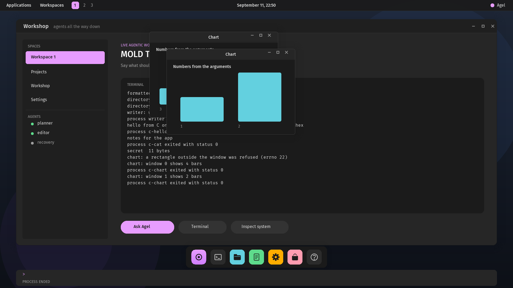

# Agel v0.2.63 — Window controls

Windows maximize, minimize to a pill in the panel, restore, and resize by
their corner; their owner is told the new size. The README is rewritten.

## What changed

- **Three controls in the header:** minimize, maximize, close, from the
  sprite sheet, lit under the pointer; each a typed command underneath
  (`:minimize N`, `:maximize N`, which also restores, `:restore N`,
  `:close N`), echoed on the console when clicked.
- **Maximize** fills the screen below the panel and restores the box the
  window had; **minimize** hides the window and leaves a pill with its
  title in the panel, which brings it back in front.
- **A corner resize:** a press in the content's bottom-right sixteen
  pixels takes hold of the size, which follows the pointer while held,
  repainted where the window was and is.
- **`EVENT_RESIZE` (5)** with the content's width and height goes to the
  owner after a maximize, a restore or a corner drag; `sketch.c` reports
  it. A window made smaller paints only the records that still fit.
- A window at the screen's edge keeps its edge and shadow on the screen.
- **The README** is a summary again: what exists, how to try it, the
  tests, the documents; the version history it had grown into stays in
  `docs/versioning.md`, and the latest desktop frame heads it.

## Proof

`scripts/test-desktop-process.sh` maximizes the sketch window and reads
`sketch: resized to 1920x920` with the header where the wallpaper was,
restores it and reads `400x300`, minimizes it and finds the pill and no
header, clicks the pill and finds the header back, drags the corner and
reads `500x350` with a wider header, then moves, covers and raises the
window as before. The full regression passes.

## Not claimed

No keyboard shortcuts, no snapping, no double-click on the header; the
maximized size is the screen's.
