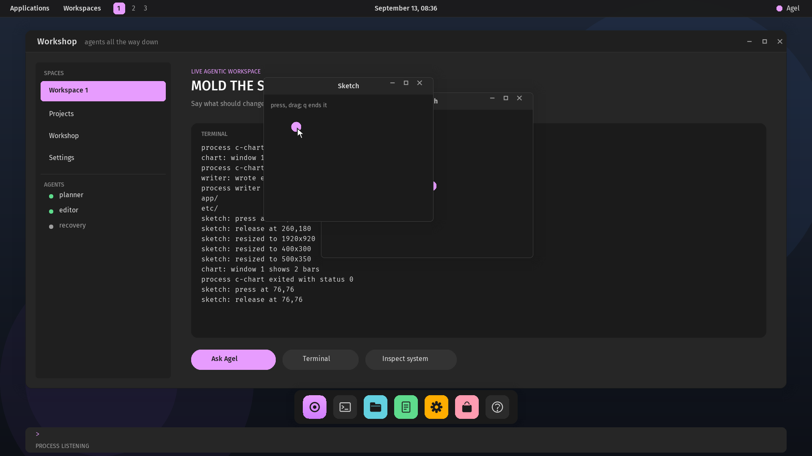

# Agel v0.2.65 — Several programs

The desktop runs more than one program at a time: every `:exec` joins
the run, each program is reported as its own tree ends, and windows and
the keyboard stay per process.

## What changed

- **The process table is the desktop's, not one program's.** `:exec`
  places its program in a free slot as a root with no parent, beside
  whatever listens or sleeps there already, up to four processes in all;
  `A PROCESS IS RUNNING` is gone. A program that ends at once is
  reported at once; one that listens gets the prompt back with
  `PROCESS LISTENING`, and the passes between inputs serve every process
  in the table.
- **Reported per tree.** `process::collect` writes one line for each
  root whose descendants have all ended and frees its slots; the desktop
  prints `PROCESS ENDED` and a fresh prompt under it whether or not
  others live on. The serial workshop's `:exec` still runs one program
  to its end, reported the same way, and a child that ends badly is
  still reported the moment it does.
- **Per-process windows and keyboard**, as before: events go to the
  owner of the window they land in, keys to the focused window's owner,
  so two sketches collect their own dots and `q` ends only the one with
  the keyboard; a click on the wallpaper gives the keyboard back to the
  workshop.

## Proof

`scripts/test-desktop-process.sh` runs a chart while a sketch listens
and reads its bars, its exit and `PROCESS ENDED` with the sketch's dot in
place once the chart's window closes; runs a second sketch beside the
first, presses in it, finds a dot in each window, quits it with `q` and
reads one exit while the first still answers a press; then quits the
first. The serial suites report programs exactly as before. The full
regression passes.

## Not claimed

Four processes is the table. A root that ends leaves its windows until
they are closed. The round-robin pass is the only scheduler, and the only
way to choose which listening program a key reaches is to click its
window.
