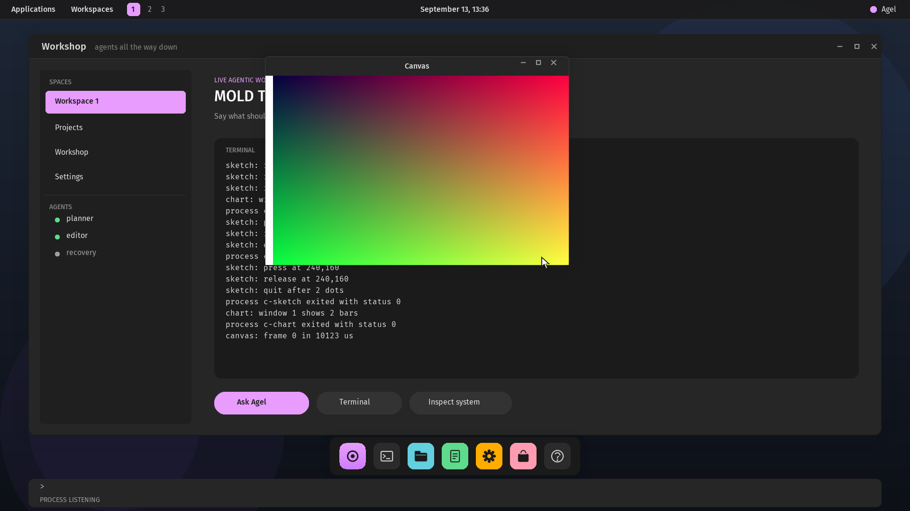

# Agel v0.2.66 — A canvas

The first rung of *Does it run DOOM?*: a process draws pixels into pages
of its own and the compositor blits them, scaled, into its window. The
programme itself is written down in `docs/doom.md`.

## What changed

- **[`docs/doom.md`](doom.md):** what others have done (a language model
  playing slowly, a 1.3M-parameter model playing in real time, a
  diffusion model as the game, reinforcement learning from pixels), what
  Agel lacks measured against `doomgeneric`'s 80 sources (all of which
  compile against `agel-libc`'s headers with two shims), the design in
  eight parts, and the order of work as roadmap lines: a canvas, key
  press and release, room on the disk and in memory, floating point and
  the missing library calls, the port, an agent that plays, a policy
  trained on its data, speech and steering.
- **`CANVAS` (22):** a window's canvas of up to 640×400 pixels at the
  top of the process's window, mapped read-write for the process and
  aliased read-only into the compositor, in canvas slots whose page
  tables are built with the compositor so no alias ever allocates.
- **Blit records (operation 11):** x, y and a scale of 1 to 4, permitted
  like any record when the scaled canvas lies inside the content; the
  compositor reads only the words the supervisor set for the window's
  slot. 320×200 at twice its size paints in about 10 ms under QEMU's TCG.
- **A canvas goes with its process:** at its end, or the window's close,
  the aliases are withdrawn and the words cleared before the frames go
  back; `release` now precedes `reclaim` for every process.
- **`agel_canvas` and `agel_blit`** in `<agel/window.h>`; `canvas.c`.

## Proof

`scripts/test-desktop-process.sh` runs `canvas.c`, reads its first
frame's time and three pixels of the screen that must be what it wrote,
quits it and requires the content plain again. `scripts/test-libc.sh`
runs it on the three serial machines, where it answers `ENODEV`. The full
regression passes.

## Not claimed

Nothing runs DOOM yet. One canvas per window, no partial damage, no alpha
or colour conversion, no double buffer: a frame written while the
compositor copies may tear.
