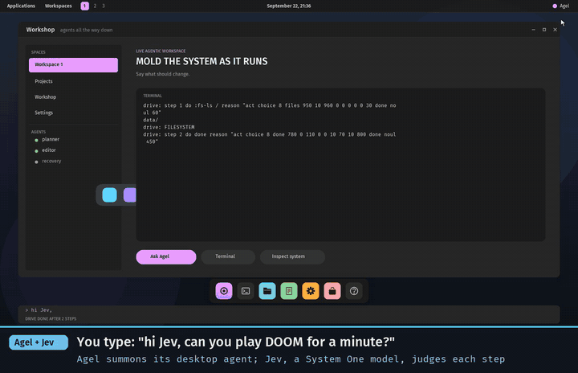

# Agel v0.2.97: the pointer is yours, frames don't flash, and Jev plays DOOM when asked

A second report from using the desktop by hand: QEMU captured the mouse
and drew a square where the pointer was, the whole screen flashed on every
click that opened a menu, and "hi, can you play DOOM for 1 minute?" typed
at the prompt did nothing. This release fixes all three, and comes with a
video of Agel and Jev using the desktop and playing DOOM, recorded live by
a script in the repository. The design notes are in
[`native-graphics.md`](native-graphics.md) and
[`computer-use.md`](computer-use.md).

## What is fixed

- **The mouse is the host's own.** The guest had only a relative PS/2
  pointer, so QEMU had to capture the host's and the guest drew its own
  where the packets took it. QEMU's `pc` machine also carries a `vmmouse`,
  an absolute pointer spoken through the VMware backdoor on port 0x5658;
  the input driver domain now enables it at boot and reads positions from
  it, so QEMU stops capturing and the desktop's pointer sits exactly under
  the host's. Without the backdoor the PS/2 pointer works as before.
- **No flash.** The compositor drew every record straight into the
  device's uncached framebuffer, and every whole frame began with the
  wallpaper, so a menu opening erased and rebuilt the screen in view. It
  now draws into a back buffer and presents the clip it drew (record kind
  12); the command bar and the pointer present on their own.
- **"Play DOOM" works.** The summoned agent's menu has `start-doom` (runs
  the game in a window) and `play-doom` (hands the desktop to the judged
  DOOM-playing agent for sixty steps, through the new `:handover NAME
  STEPS` command the console loop performs once the drive ends), or
  starts the game first when no window is open.
  `run-graphics.sh` boots a persistent desktop disk with the game, its
  data, the hosted runtime and the browser's site installed. Named `doom`
  and `play` at first, the judge started the game and then waited eight
  times: the names say what they do now.

## What changed underneath

- **The supervisor stack moved** from 0x90000 (about 200 KiB of low
  memory) to a megabyte below 2 MiB: one command started from inside
  another — the game's exec from inside the drive loop — overflowed it and
  the machine stopped.
- **The desktop programs' sources left the kernel image** for the data
  region (`/data/wb.agel` … `/data/dk.agel`, installed by
  `scripts/build-boot.sh`); the desktop reads a program through the
  filesystem service when it loads one. The kernel is 256829 bytes of the
  260096 budget. A size-optimised build was tried and rejected: it outlined
  memory routines the ring-3 evaluator then faulted on.
- **The attached bridge answers the game too**: a request without a
  `task:` line is the game's, judged with the game's fields and the last
  eight steps as history.
- **`:handover` focuses the game's window**: the front-most window a live
  process owns takes the keyboard before `:play`, whatever had it.
- **`load` replaces a world of programs**: a world holding only cells of
  programs the desktop carries is replaced by a load; one with a cell of
  the operator's own is kept.
- **Found by the regression, fixed before the tag**: the back buffer's
  address and the vmmouse routines are gated on `native-graphics`, so a
  workshop build compiles again; `scripts/build-boot.sh` installs the
  desktop's program sources only for a desktop build and removes them
  otherwise (`install-program.py --remove`), so a workshop image's data
  region lists what a workshop test installed and nothing else; the
  bridge test's stand-in judge names the agent's options as they are now.
  A stand-in that answered an error left the desktop's drive loop waiting
  after its first step; that hang is not fixed here and is listed as open.

## The video

[](media/agel-jev-demo.mp4)

[`media/agel-jev-demo.mp4`](media/agel-jev-demo.mp4), 2½ minutes, recorded
by [`scripts/record-demo.py`](../scripts/record-demo.py): it boots the
desktop headless with the live judge attached through `agel-play
--attach`, uses the machine as a person would — QEMU's absolute mouse and
its keyboard, nothing typed on the serial console — screenshots it twice a
second, and captions each frame from what the console said at that moment.
The whole take was 134 seconds of real time; nothing is sped up or cut
except the title cards. What happened, from the console:

```text
(a click on the desktop)          WORKBENCH READY - CLICK OR TAB
list the files on the disk, then finish
drive: step 1 do :fs-ls / reason "act choice 8 files 950 …"
drive: step 2 do done reason "act choice 8 done 780 … done noul 450"
hi Jev, can you play DOOM for a minute?
drive: step 1 do :exec c-doom -- -iwad /data/doom1.wad -mb 8 -warp 1 -skill 2 reason "act choice 8 start-doom 410 30 10 480 440 …"
doom: frame 0 at 35540 ms
drive: step 4 do done reason "act choice 8 wait 590 … done noul 520"
(a click beside the game; the game's window held the keyboard)
the game is running now, please play it
drive: step 1 do :handover doom-agent-judge 60 reason "act choice 8 play-doom 720 50 0 10 750 …"
play: step 1 keys (up) reason "act choice 6 forward 680 730 20 50 110 50 40 foe noul 240 risk score 3 150 …"
…
play: step 60 keys (up) reason "act choice 6 forward 900 910 10 30 30 10 10 foe noul 130 risk score 3 90 …"
PLAYED 60 STEPS
```

Asked to play, the judge chose `start-doom` over `play-doom` by 480 to
440, then called the task done while the game booted; asked again with the
game running, it chose `play-doom` at 750. The DOOM agent went forward 54
of 60 steps and turned six times at walls on its own reflex; Jev saw no
enemy (13 to 24%) and put the risk near the bottom. Six takes were
recorded to get here, and each earlier one found something fixed in this
release:

- the judge picked `play-doom` before any game existed, so `play-doom`
  with no window open now starts the game first — policy in the program,
  from the look line's window count;
- the game's window holds the keyboard once it opens, so a sentence typed
  then goes to the game, as on any desktop: the person clicks beside it;
- that click took the focus from the game, so `:handover` now gives the
  keyboard to the front-most window a live process owns before it plays;
- the exec of the game from inside the drive loop overflowed the
  supervisor stack (the stack move below).

## Validation

- The full local regression, rebuilt from the CI workflow's own steps
  (81 suites), and CI.
- `scripts/test-desktop-process.py`, `test-native-workbench.py` and
  `test-play.py` move the pointer with absolute events now and land on the
  pixel named; `test-native-dock.py` compares the device's pixels across a
  compositor replacement and a reboot, which is what the present has to
  get right.
- `scripts/test-drive.sh`, `test-native-workbench.py`: the agent's menu,
  the program loads read from the data region, the summoned agent joining
  the workbench.
- By hand: the video above, live against the endpoint.

## Not claimed

- A judge's error reply during `:drive` stops the loop from asking again
  (seen with a stand-in that named options the program no longer has);
  the loop has to be told to stop or the machine reset. Open.

- Any skill at DOOM: sixty judged steps on E1M1, one run.
- A pointer without QEMU's `vmmouse`, or on the other machines.
- A flicker-free desktop in every path: every render presents what it
  drew, but the compositor still draws record by record into the back
  buffer, so a whole frame takes as long as before to appear, only whole.
- More than 3267 bytes of kernel headroom.
